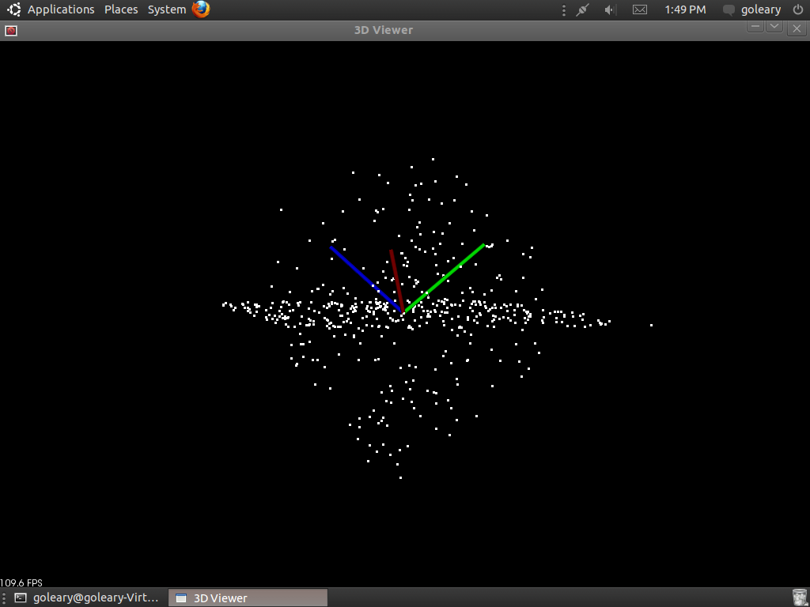
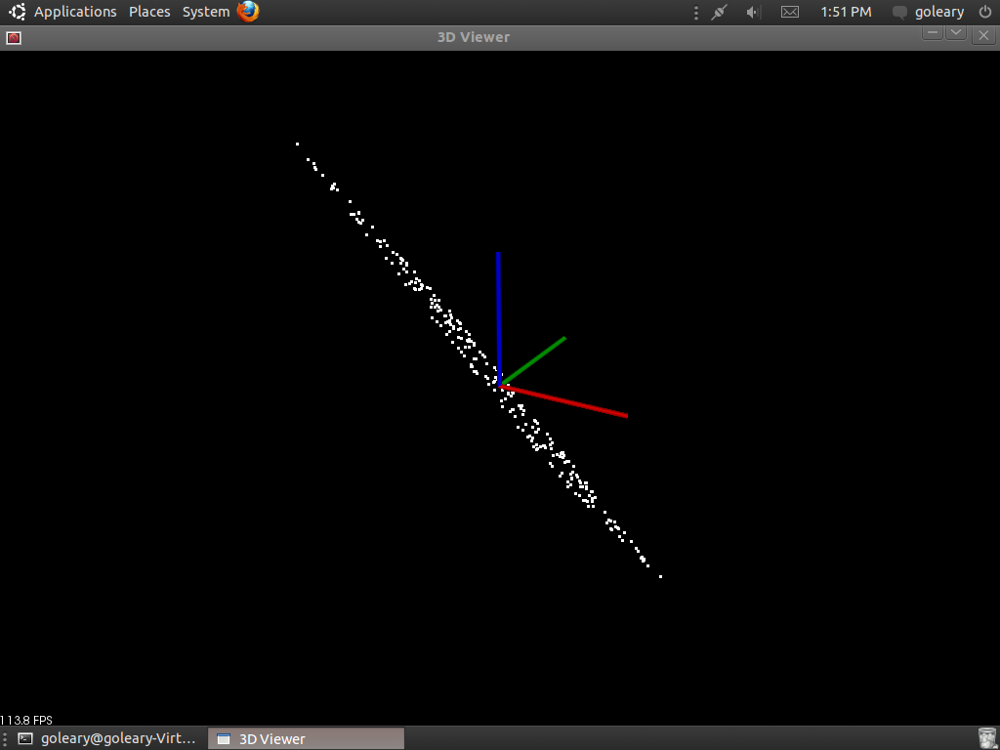

.. _random_sample_consensus:

How to use Random Sample Consensus model
----------------------------------------

In this tutorial we learn how to use a RandomSampleConsensus with a plane model to obtain the cloud fitting to this model.

The code
--------

Create a file, let's say, ``random_sample_consensus.cpp`` in your favorite editor and place the following inside:

.. literalinclude:: sources/random_sample_consensus/random_sample_consensus.cpp
   :language: cpp
   :linenos:

The explanation
---------------

The following source code initializes two PointClouds and fills one of them with points.  The majority of these points are placed in the cloud according to a model, but a fraction (1/8) of them are given arbitrary locations.

.. literalinclude:: sources/random_sample_consensus/random_sample_consensus.cpp
   :language: cpp
   :lines: 29-43

Now we create our RandomSampleConsensus object using a plane model that uses our input cloud.

.. literalinclude:: sources/random_sample_consensus/random_sample_consensus.cpp
   :language: cpp
   :lines: 44-50

This last bit of code copys all of the points that fit our model to another cloud and then display either that or our original cloud in the viewer.

.. literalinclude:: sources/random_sample_consensus/random_sample_consensus.cpp
   :language: cpp
   :lines: 52-56

There is some extra code that relates to the display of the PointClouds in the 3D Viewer, but I'm not going to explain that here.

Compiling and running the program
---------------------------------

Add the following lines to your CMakeLists.txt file:

.. literalinclude:: sources/random_sample_consensus/CMakeLists.txt
   :language: cmake
   :linenos:

After you have made the executable, you can run it. Simply do::

  $ ./random_sample_consensus

to have a viewer window display that shows you the original PointCloud (with outliers) we have created.

Hit 'r' on your keyboard to scale and center the viewer.  You can then click and drag to rotate the view.  Pressing 'q' on your keyboard will close the viewer and end the program.  Now if you run the program with the following argument::

  $ ./random_sample_consensus -f

the program will display only the indices of the original PointCloud which satisfy the paticular model we have chosen (in this case plane) as found by RandomSampleConsens in the viewer.

Again hit 'r' to scale and cetner the view and then click and drag with the mouse to rotate around the cloud.  You can see there are no longer any points that do not lie with in the plane model in this PointCloud. Hit 'q' to exit the viewer and program.
