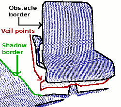

.. _range_image_border_extraction:

How to extract borders from range images
----------------------------------------

This tutorial demonstrates how to extract borders (traversals from foreground to background) from a range image. We are interested in three different kinds of points: object borders, which are the outermost visible points still belonging to an object, shadow borders, which are points in the background that adjoin occlusions, and veil points, interpolated points between the obstacle border and the shadow border, which are a typical phenomenon in 3D range data obtained by lidars.

The code
--------

First, create a file called, let's say, ``range_image_border_extraction.cpp`` in your favorite
editor, and place the following code inside it:

.. literalinclude:: sources/range_image_border_extraction/range_image_border_extraction.cpp
   :language: cpp
   :linenos:

   
Explanation
-----------

In the beginning we do command line parsing, read a point cloud from disc (or create it if not provided), create a range image and visualize it. All of these steps are already covered in the tutorial 'Range Image Visualization'.

There is only one slight deviation. To extract the border information, it is important to differentiate between range image points that are unobserved and points that should have been observed but were out of range for the sensor. The latter typically marks a border, whereas unobserved points typically do not. Therefore it is useful to provide those measurements, if they are available. We expect to find an additional pcd file containing those values:

.. code-block:: cpp

  ...
  std::string far_ranges_filename = pcl::getFilenameWithoutExtension (filename)+"_far_ranges.pcd";
  if (pcl::io::loadPCDFile(far_ranges_filename.c_str(), far_ranges) == -1)
    std::cout << "Far ranges file \""<<far_ranges_filename<<"\" does not exists.\n";
  ...

they are later on integrated into the range image with

.. code-block:: cpp

  ...
  range_image.integrateFarRanges (far_ranges);
  ...

If those values are not available, the command line parameter -m can be used to assume, that all unobserved points are actually far ranges. This is done in the code with

.. code-block:: cpp

  ...
  if (setUnseenToMaxRange)
    range_image.setUnseenToMaxRange ();
  ...

Now we come to the relevant part for the actual border extraction:

.. code-block:: cpp

  ...
  pcl::RangeImageBorderExtractor border_extractor (&range_image);
  pcl::PointCloud<pcl::BorderDescription> border_descriptions;
  border_extractor.compute (border_descriptions);
  ...

This creates the RangeImageBorderExtractor object, gives it the range image and calculates the border information, which is stored in border_descriptions (see common/include/pcl/point_types.h for details on the BorderDescription struct)

The remaining code is only for visualization purposes.

Compiling and running the program
---------------------------------

Add the following lines to your CMakeLists.txt file:

.. literalinclude:: sources/range_image_border_extraction/CMakeLists.txt
   :language: cmake
   :linenos:
   
After you have made the executable, you can run it. Simply do::

  $ ./range_image_border_extraction -m

This will use an autogenerated point cloud of a rectangle floating in space.

You can also try it with an actual point cloud on your disc::

  $ ./range_image_border_extraction <point_cloud.pcd>

The extracted borders will be visualized as a range image widget and also in a 3D viewer.
