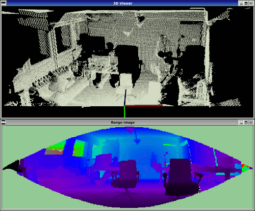

.. _range_image_visualization:

How to visualize a range image
------------------------------

This tutorial demonstrates how to visualize a range image with two different means. As a point cloud (since RangeImage is derived from PointCloud) in a 3D viewer and as a picture visualizing the range values as colors.

The code
--------

First, create a file called, let's say, ``range_image_visualization.cpp`` in your favorite
editor, and place the following code inside it:

.. literalinclude:: sources/range_image_visualization/range_image_visualization.cpp
   :language: cpp
   :linenos:

Explanation
-----------

In the beginning we do command line parsing, read a point cloud from disc (or create it if not provided) and create a range image. All of these steps are already covered in the 'How to create a range image from a point cloud' tutorial.

The interesting part begins here:

.. code-block:: cpp

  ...
  pcl::visualization::PCLVisualizer viewer ("3D Viewer");
  viewer.setBackgroundColor (1, 1, 1);
  pcl::visualization::PointCloudColorHandlerCustom<pcl::PointWithRange> range_image_color_handler (range_image_ptr, 0, 0, 0);
  viewer.addPointCloud (range_image_ptr, range_image_color_handler, "range image");
  viewer.setPointCloudRenderingProperties (pcl::visualization::PCL_VISUALIZER_POINT_SIZE, 1, "range image");
  //viewer.addCoordinateSystem (1.0f);
  //pcl::visualization::PointCloudColorHandlerCustom<PointType> point_cloud_color_handler (point_cloud_ptr, 150, 150, 150);
  //viewer.addPointCloud (point_cloud_ptr, point_cloud_color_handler, "original point cloud");
  viewer.initCameraParameters ();
  setViewerPose(viewer, range_image.getTransformationToWorldSystem ());
  ...

This creates the 3D viewer object, sets the background color to white, adds the range image (as a point cloud) with color black and point size 1 and sets the viewing position in the viewer to the sensor position from the range image (using a function defined above the main). The commented part can be used to add a coordinate system and also visualize the original point cloud.

The next part visualizes the range image in 2D, using color coding for the range values:

.. code-block:: cpp

  ...
  pcl::visualization::RangeImageVisualizer range_image_widget ("Range image");
  range_image_widget.setRangeImage (range_image);
  ...

Now we can start the main loop to keep the visualization alive, until the viewer window is closed:

.. code-block:: cpp

  ...
  while (!viewer.wasStopped ())
  {
    range_image_widget.spinOnce ();
    viewer.spinOnce ();
    pcl_sleep (0.01);
  ...

range_image_widget.spinOnce() handles the current events of the RangeImageVisualizer and viewer.spinOnce() does the same for the 3D viewer.

Additionally there is the possibility to always update the 2D range image to correspond to the current percpective in the viewer window, which is activated using the command line parameter -l:

.. code-block:: cpp

  ...
    if (live_update)
    {
      scene_sensor_pose = viewer.getViewerPose();
      range_image.createFromPointCloud (point_cloud, angular_resolution, pcl::deg2rad (360.0f), pcl::deg2rad (180.0f),
                                        scene_sensor_pose, pcl::RangeImage::LASER_FRAME, noise_level, min_range, border_size);
      range_image_widget.setRangeImage (range_image);
    }
  }
  ...

Here we first get the current viewing position from the viewer window and then recreate the range image.

Compiling and running the program
---------------------------------

Add the following lines to your CMakeLists.txt file:

.. literalinclude:: sources/range_image_visualization/CMakeLists.txt
   :language: cmake
   :linenos:

After you have made the executable, you can run it. Simply do::

  $ ./range_image_visualization

This will use an autogenerated point cloud of a rectangle floating in space. It opens two windows, one a 3D viewer of the point cloud and one a visual version of the range image, where the range values are color coded.

You can also try it with a point cloud file from your hard drive::

  $ ./range_image_visualization <point_cloud.pcd>

You can also try the -l parameter to update the range image according to the current perspective in the viewer::

$ ./range_image_visualization -l <point_cloud.pcd>

The output should look similar to this:

Unseen areas (range -INFINITY) are shown in pale green and far ranges (range INFINITY - if available in the scan) in pale blue.

