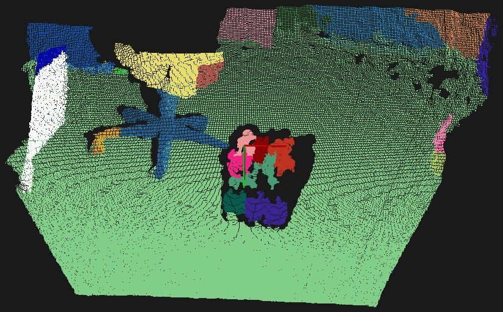

.. _region_growing_rgb_segmentation:

Color-based region growing segmentation
---------------------------------------

In this tutorial we will learn how to use the color-based region growing algorithm implemented in the ``pcl::RegionGrowingRGB`` class.
This algorithm is based on the same concept as the ``pcl::RegionGrowing`` that is described in the :ref:`region_growing_segmentation` tutorial.
If you are interested in the understanding of the base idea, please refer to the mentioned tutorial.

There are two main differences in the color-based algorithm. The first one is that it uses color instead of normals.
The second is that it uses the merging algorithm for over- and under- segmentation control.
Let's take a look at how it is done. After the segmentation, an attempt for merging clusters with close colors is made.
Two neighbouring clusters with a small difference between average color are merged together.
Then the second merging step takes place. During this step every single cluster is verified by the number of points that it contains.
If this number is less than the user-defined value than current cluster is merged with the closest neighbouring cluster.

The code
--------

This tutorial requires colored cloud. You can use `this one <https://raw.github.com/PointCloudLibrary/data/master/tutorials/region_growing_rgb_tutorial.pcd>`_.
Next what you need to do is to create a file ``region_growing_rgb_segmentation.cpp`` in any editor you prefer and copy the following code inside of it:

.. literalinclude:: sources/region_growing_rgb_segmentation/region_growing_rgb_segmentation.cpp
   :language: cpp
   :linenos:

The explanation
---------------

Now let's study out what is the purpose of this code.

Let's take a look at first lines that are of interest:

.. literalinclude:: sources/region_growing_rgb_segmentation/region_growing_rgb_segmentation.cpp
   :language: cpp
   :lines: 16-21

They are simply loading the cloud from the .pcd file. Note that points must have the color.

.. literalinclude:: sources/region_growing_rgb_segmentation/region_growing_rgb_segmentation.cpp
   :language: cpp
   :lines: 30-30

This line is responsible for ``pcl::RegionGrowingRGB`` instantiation. This class has two parameters:

* PointT - type of points to use(in the given example it is ``pcl::PointXYZRGB``)
* NormalT - type of normals to use. Insofar as ``pcl::RegionGrowingRGB`` is derived from the ``pcl::RegionGrowing``, it can use both tests at the same time:
  color test and normal test. The given example uses only the first one, therefore type of normals is not used.

.. literalinclude:: sources/region_growing_rgb_segmentation/region_growing_rgb_segmentation.cpp
   :language: cpp
   :lines: 31-33

These lines provide the instance with the input cloud, indices and search method.

.. literalinclude:: sources/region_growing_rgb_segmentation/region_growing_rgb_segmentation.cpp
   :language: cpp
   :lines: 34-34

Here the distance threshold is set. It is used to determine whether the point is neighbouring or not. If the point is located at a distance less than
the given threshold, then it is considered to be neighbouring. It is used for clusters neighbours search.

.. literalinclude:: sources/region_growing_rgb_segmentation/region_growing_rgb_segmentation.cpp
   :language: cpp
   :lines: 35-35

This line sets the color threshold. Just as angle threshold is used for testing points normals in ``pcl::RegionGrowing``
to determine if the point belongs to cluster, this value is used for testing points colors.

.. literalinclude:: sources/region_growing_rgb_segmentation/region_growing_rgb_segmentation.cpp
   :language: cpp
   :lines: 36-36

Here the color threshold for clusters is set. This value is similar to the previous, but is used when the merging process takes place.

.. literalinclude:: sources/region_growing_rgb_segmentation/region_growing_rgb_segmentation.cpp
   :language: cpp
   :lines: 37-37

This value is similar to that which was used in the :ref:`region_growing_segmentation` tutorial. In addition to that, it is used for merging process mentioned in the begining.
If cluster has less points than was set through ``setMinClusterSize`` method, then it will be merged with the nearest neighbour.

.. literalinclude:: sources/region_growing_rgb_segmentation/region_growing_rgb_segmentation.cpp
   :language: cpp
   :lines: 39-40

Here is the place where the algorithm is launched. It will return the array of clusters when the segmentation process will be over.

Remaining lines are responsible for the visualization of the colored cloud, where each cluster has its own color.

Compiling and running the program
---------------------------------

Add the following lines to your CMakeLists.txt file:

.. literalinclude:: sources/region_growing_rgb_segmentation/CMakeLists.txt
   :language: cmake
   :linenos:

After you have made the executable, you can run it. Simply do::

  $ ./region_growing_rgb_segmentation

After the segmentation the cloud viewer window will be opened and you will see something similar to this image:

