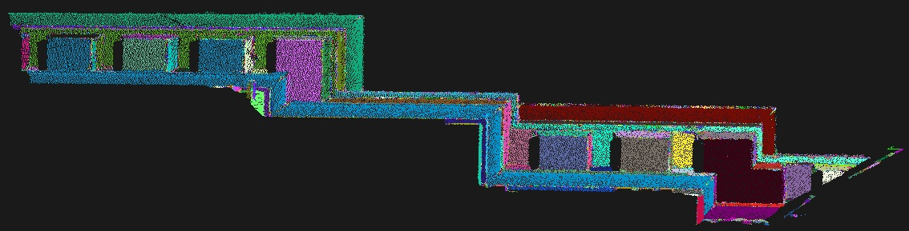
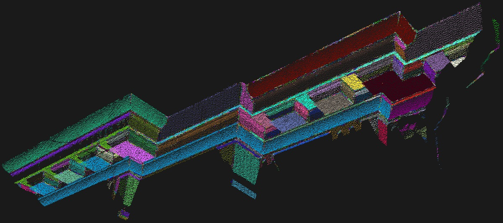
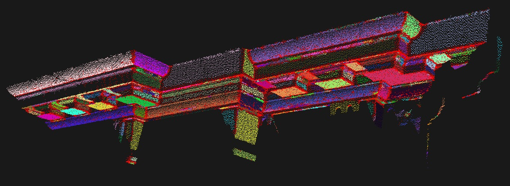

.. _region_growing_segmentation:

Region growing segmentation
---------------------------

In this tutorial we will learn how to use the region growing algorithm implemented in the ``pcl::RegionGrowing`` class.
The purpose of the said algorithm is to merge the points that are close enough in terms of the smoothness constraint.
Thereby, the output of this algorithm is the set of clusters,
were each cluster is a set of points that are considered to be a part of the same smooth surface.
The work of this algorithm is based on the comparison of the angles between the points normals.

Theoretical Primer
---------------------------

Let's take a look on how the algorithm works.

First of all it sorts the points by their curvature value.
It needs to be done because the region begins its growth from the point that has the minimum curvature value.
The reason for this is that the point with the minimum curvature is located in the flat area (growth from the flattest area
allows to reduce the total number of segments).

So we have the sorted cloud. Until there are unlabeled points in the cloud, algorithm picks up the point with minimum curvature value and starts the growth of the region. This process occurs as follows:

  * The picked point is added to the set called seeds.
  * For every seed point algorithm finds neighbouring points.
     
     * Every neighbour is tested for the angle between its normal and normal of the current seed point. If the angle is less than threshold value
       then current point is added to the current region.
     * After that every neighbour is tested for the curvature value. If the curvature is less than threshold value then this point is added to the seeds.
     * Current seed is removed from the seeds.

If the seeds set becomes empty this means that the algorithm has grown the region and the process is repeated from the beginning.
You can find the pseudocode for the said algorithm below.

Inputs:
  
  * *Point cloud* = :math:`\{P\}`
  * *Point normals* = :math:`\{N\}`
  * *Points curvatures* = :math:`\{c\}`
  * *Neighbour finding function* :math:`\Omega(.)`
  * *Curvature threshold* :math:`c_{th}`
  * *Angle threshold* :math:`\theta_{th}`

Initialize:
  
  * *Region list* :math:`{R}\leftarrow{\O}`
  * *Available points list* :math:`\{A\}\leftarrow\{1,...,|P|\}`

Algorithm:

  * **While** :math:`\{A\}` *is not empty* **do**
     
     * *Current region* :math:`\{R_c\}\leftarrow{\O}`
     * *Current seeds* :math:`\{S_c\}\leftarrow{\O}`
     * *Point with minimum curvature in* :math:`\{A\}\rightarrow P_{min}`
     * :math:`\{S_c\}\leftarrow\{S_c\}\cup P_{min}`
     * :math:`\{R_c\}\leftarrow\{R_c\}\cup P_{min}`
     * :math:`\{A\}\leftarrow\{A\}\setminus P_{min}`
     * **for** :math:`i=0` *to* **size** ( :math:`\{S_c\}` ) **do**
          
          * *Find nearest neighbours of current seed point* :math:`\{B_c\}\leftarrow\Omega(S_c\{i\})`
          * **for** :math:`j=0` *to* **size** ( :math:`\{B_c\}` ) **do**
               
               * *Current neighbour point* :math:`P_j\leftarrow B_c\{j\}`
               * **If** :math:`\{A\}` *contains* :math:`P_j` *and* :math:`cos^{-1}(|(N\{S_c\{i\}\},N\{S_c\{j\}\})|)<\theta_{th}` **then**
                    
                    * :math:`\{R_c\}\leftarrow\{R_c\}\cup P_j`
                    * :math:`\{A\}\leftarrow\{A\}\setminus P_j`
                    * **If** :math:`c\{P_j\}<c_{th}` **then**

                         * :math:`\{S_c\}\leftarrow\{S_c\}\cup P_j`

                    * **end if**

               * **end if**

          * **end for**

     * **end for**
     * *Add current region to global segment list* :math:`\{R\}\leftarrow\{R\}\cup\{R_c\}`

 * **end while**
 * **Return** :math:`\{R\}`

The code
--------

First of all you will need the point cloud for this tutorial.
`This <https://raw.github.com/PointCloudLibrary/data/master/tutorials/region_growing_tutorial.pcd>`_ is a good one for the purposes of the algorithm.
Next what you need to do is to create a file ``region_growing_segmentation.cpp`` in any editor you prefer and copy the following code inside of it:

.. literalinclude:: sources/region_growing_segmentation/region_growing_segmentation.cpp
   :language: cpp
   :linenos:

The explanation
---------------

Now let's study out what is the purpose of this code. First few lines will be omitted, because they are obvious.

First lines that are of interest are these:

.. literalinclude:: sources/region_growing_segmentation/region_growing_segmentation.cpp
   :language: cpp
   :lines: 15-20

They are simply loading the cloud from the .pcd file. No doubt that you saw how it is done hundreds of times, so let's move on.

.. literalinclude:: sources/region_growing_segmentation/region_growing_segmentation.cpp
   :language: cpp
   :lines: 22-28

As mentioned before, the algorithm requires normals. Here the ``pcl::NormalEstimation`` class is used to compute them.
To learn more about how it is done you should take a look at the :ref:`normal_estimation` tutorial in the **Features** section.

.. literalinclude:: sources/region_growing_segmentation/region_growing_segmentation.cpp
   :language: cpp
   :lines: 30-35

These lines are given only for example. You can safely comment this part. Insofar as ``pcl::RegionGrowing`` is derived from ``pcl::PCLBase``,
it can work with indices. It means you can point that you need to segment only
those points that are listed in the indices array instead of the whole point cloud.

.. literalinclude:: sources/region_growing_segmentation/region_growing_segmentation.cpp
   :language: cpp
   :lines: 37-39

You have finally reached the part where ``pcl::RegionGrowing`` is instantiated. It is a template class that have two parameters:

* PointT - type of points to use(in the given example it is ``pcl::PointXYZ``)
* NormalT - type of normals to use(in the given example it is ``pcl::Normal``)

After that minimum and maximum cluster sizes are set. It means that
after the segmentation is done all clusters that have less points then was set as minimum(or have more than maximum) will be discarded.
The default values for minimum and maximum are 1 and 'as much as possible' respectively.

.. literalinclude:: sources/region_growing_segmentation/region_growing_segmentation.cpp
   :language: cpp
   :lines: 40-44

The algorithm needs K nearest search in its internal structure, so here is the place where a search method is provided
and number of neighbours is set. After that it receives the cloud that must be segmented, point indices and normals.

.. literalinclude:: sources/region_growing_segmentation/region_growing_segmentation.cpp
   :language: cpp
   :lines: 45-46

This two lines are most important part in the algorithm initialization, because they are responsible for the mentioned smoothness constraint.
First method sets the angle in radians that will be used as the allowable range for the normals deviation.
If the deviation between points normals is less than smoothness threshold then they are suggested to be in the same cluster
(new point - the tested one - will be added to the cluster).
The second one is responsible for curvature threshold. If two points have a small normals deviation then the disparity between their curvatures is tested.
And if this value is less than curvature threshold then the algorithm will continue the growth of the cluster using new added point.

.. literalinclude:: sources/region_growing_segmentation/region_growing_segmentation.cpp
   :language: cpp
   :lines: 48-49

This method simply launches the segmentation algorithm. After its work it will return clusters array.

.. literalinclude:: sources/region_growing_segmentation/region_growing_segmentation.cpp
   :language: cpp
   :lines: 51-63

These lines are simple enough, so they won't be commented. They are intended for those who are not familiar with how to work with ``pcl::PointIndices``
and how to access its elements.

.. literalinclude:: sources/region_growing_segmentation/region_growing_segmentation.cpp
   :language: cpp
   :lines: 65-73

The ``pcl::RegionGrowing`` class provides a method that returns the colored cloud where each cluster has its own color.
So in this part of code the ``pcl::visualization::CloudViewer`` is instanciated for viewing the result of the segmentation - the same colored cloud.
You can learn more about cloud visualization in the :ref:`cloud_viewer` tutorial.

Compiling and running the program
---------------------------------

Add the following lines to your CMakeLists.txt file:

.. literalinclude:: sources/region_growing_segmentation/CMakeLists.txt
   :language: cmake
   :linenos:

After you have made the executable, you can run it. Simply do::

  $ ./region_growing_segmentation

After the segmentation the cloud viewer window will be opened and you will see something similar to those images:

On the last image you can see that the colored cloud has many red points. This means that these points belong to the clusters
that were rejected, because they had too much/little points.

