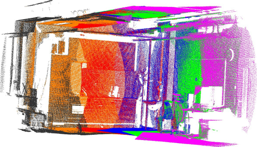
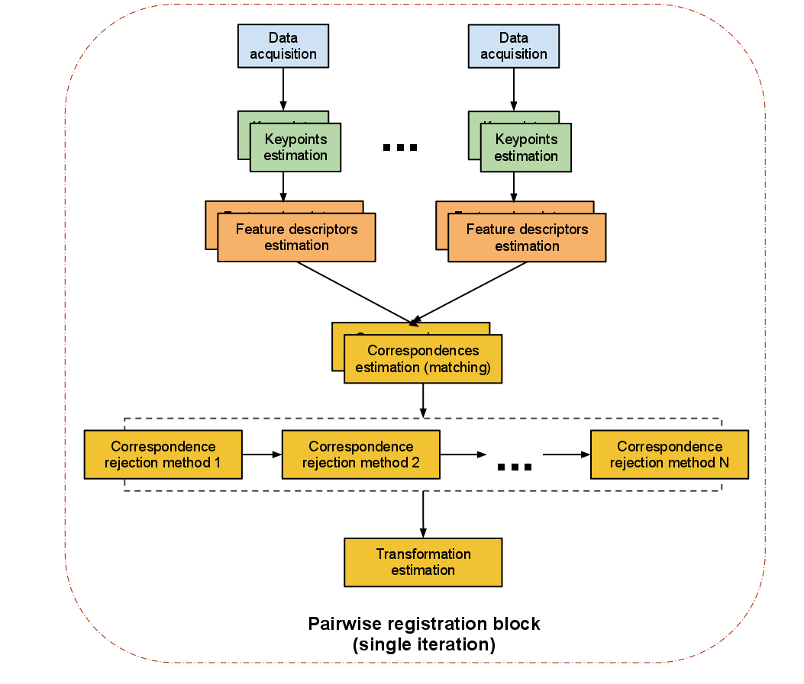

.. _registration_api:

The PCL Registration API
------------------------

The problem of consistently aligning various 3D point cloud data views into a
complete model is known as **registration**. Its goal is to find the relative
positions and orientations of the separately acquired views in a global
coordinate framework, such that the intersecting areas between them overlap
perfectly. For every set of point cloud datasets acquired from different views,
we therefore need a system that is able to align them together into a single
point cloud model, so that subsequent processing steps such as segmentation and
object reconstruction can be applied. 

.. image:: images/registration/scans.png
    :align: center

A motivation example in this sense is given in the figure above, where a set of
six individual datasets has been acquired using a tilting 2D laser unit. Since
each individual scan represents only a small part of the surrounding world, it
is imperative to find ways to register them together, thus creating the complete
point cloud model as shown in the figure below.

The algorithmic work in the PCL registration library is motivated by finding
correct point correspondences in the given input datasets, and estimating rigid
transformations that can rotate and translate each individual dataset into a
consistent global coordinate framework. This registration paradigm becomes
easily solvable if the point correspondences are perfectly known in the input
datasets. This means that a selected list of points in one dataset have to
"coincide" from a feature representation point of view with a list of points
from another dataset. Additionally, if the correspondences estimated are
"perfect", then the registration problem has a closed form solution.

PCL contains a set of powerful algorithms that allow the estimation of multiple
sets of correspondences, as well as methods for rejecting bad correspondences,
and estimating transformations in a robust manner from them. The following
sections will describe each of them individually.

An overview of pairwise registration
------------------------------------

We sometimes refer to the problem of registering a pair of point cloud datasets
together as *pairwise registration*, and its output is usually a rigid
transformation matrix (4x4) representing the rotation and translation that would
have to be aplied on one of the datasets (let's call it *source*) in order for
it to be perfectly aligned with the other dataset (let's call it *target*, or
*model*).

The steps performed in a *pairwise registration* step are shown in the diagram
below. Please note that we are representing a single iteration of the algorithm.
The programmer can decide to loop over any or all of the steps.

Registration Components
-----------------------

IterativeClosestPoint
=====================
1) Search for correspondences.
2) Reject bad correspondences.
3) Estimate a transformation using the good correspondences.
4) Iterate.

CorrespondenceEstimation
========================
- CorrespondenceEstimation
- CorrespondenceRejectionXXX
- TransfromationEstimationYYY
You can actually use these directly and make a for loop around them. The problem with "feeding two kinect datasets into a correspondence estimation" directly is:
- You have 300k points in each frame.
- So there can be 300k^2 correspondences.
- Even on a beefy computer, this is a lot.
- Plus rejecting many of those will be problematic, because what do you reject them based on?
their "color"? not good enough, their "x, y, z" values? also bad

Keypoints
=========
That's where feature descriptors come into play and more importantly, keypoints. A keypoint is an interest point that has a "special property" in the scene, like the corner of a book, or the letter "P" on a book that has written "PCL" on it.

Pipeline
========
1) use SIFT Keypoints (pcl::SIFT...something)
2) use FPFH descriptors (pcl::FPFHEstimation) at the keypoints (see our tutorials for that, like http://www.pointclouds.org/media/rss2011.html)
3) get the FPFH descriptors and estimate correspondences using pcl::CorrespondenceEstimation
4) reject bad correspondences using one or many of the pcl::CorrespondenceRejectionXXX methods
5) finally get a transformation as mentioned above
