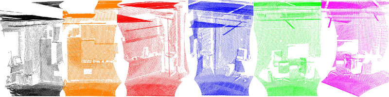
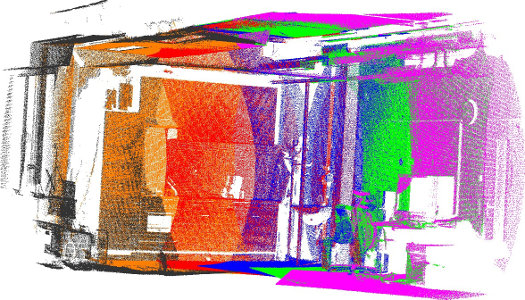
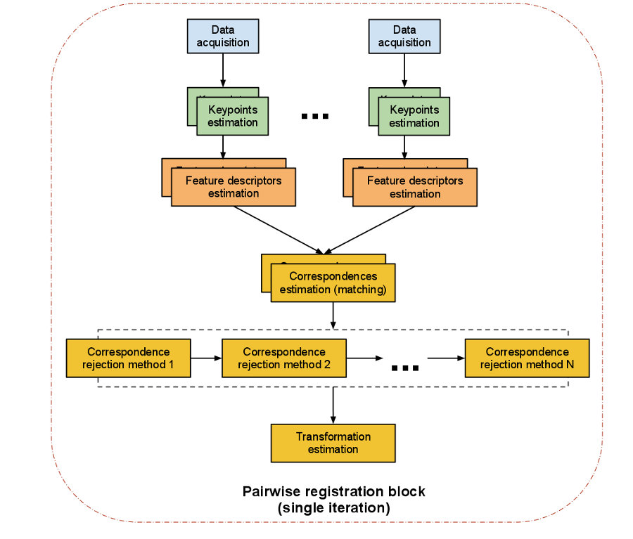

.. _registration_api:

The PCL Registration API
------------------------

The problem of consistently aligning various 3D point cloud data views into a
complete model is known as **registration**. Its goal is to find the relative
positions and orientations of the separately acquired views in a global
coordinate framework, such that the intersecting areas between them overlap
perfectly. For every set of point cloud datasets acquired from different views,
we therefore need a system that is able to align them together into a single
point cloud model, so that subsequent processing steps such as segmentation and
object reconstruction can be applied. 

A motivation example in this sense is given in the figure above, where a set of
six individual datasets has been acquired using a tilting 2D laser unit. Since
each individual scan represents only a small part of the surrounding world, it
is imperative to find ways to register them together, thus creating the complete
point cloud model as shown in the figure below.

The algorithmic work in the PCL registration library is motivated by finding
correct point correspondences in the given input datasets, and estimating rigid
transformations that can rotate and translate each individual dataset into a
consistent global coordinate framework. This registration paradigm becomes
easily solvable if the point correspondences are perfectly known in the input
datasets. This means that a selected list of points in one dataset have to
"coincide" from a feature representation point of view with a list of points
from another dataset. Additionally, if the correspondences estimated are
"perfect", then the registration problem has a closed form solution.

PCL contains a set of powerful algorithms that allow the estimation of multiple
sets of correspondences, as well as methods for rejecting bad correspondences,
and estimating transformations in a robust manner from them. The following
sections will describe each of them individually.

An overview of pairwise registration
------------------------------------

We sometimes refer to the problem of registering a pair of point cloud datasets
together as *pairwise registration*, and its output is usually a rigid
transformation matrix (4x4) representing the rotation and translation that would
have to be applied on one of the datasets (let's call it *source*) in order for
it to be perfectly aligned with the other dataset (let's call it *target*, or
*model*).

The steps performed in a *pairwise registration* step are shown in the diagram
below. Please note that we are representing a single iteration of the algorithm.
The programmer can decide to loop over any or all of the steps.

The computational steps for two datasets are straightforward:

  * from a set of points, identify **interest points** (i.e., **keypoints**) that best represent the scene in both datasets;
  * at each keypoint, compute a **feature descriptor**;
  * from the set of **feature descriptors** together with their XYZ positions in the two datasets, estimate a set of **correspondences**, based on the similarities between features and positions;
  * given that the data is assumed to be noisy, not all correspondences are valid, so reject those bad correspondences that contribute negatively to the registration process;
  * from the remaining set of good correspondences, estimate a motion transformation.

Registration modules
--------------------

Let's have a look at the single steps of the pipeline.

Keypoints
=========

A keypoint is an interest point that has a "special property" in the scene,
like the corner of a book, or the letter "P" on a book that has written "PCL"
on it. There are a number of different keypoints available in PCL like NARF,
SIFT and FAST. Alternatively you can take every point, or a subset, as
keypoints as well. The problem with "feeding two kinect datasets into a correspondence estimation" directly is that you have 300k points in each frame, so there can be 300k^2 correspondences.

Feature descriptors
===================

Based on the keypoints found we have to extract [features](http://www.pointclouds.org/documentation/tutorials/how_features_work.php), where we assemble the information and generate vectors to compare them with each other. Again there
is a number of feature options to choose from, for example NARF, FPFH, BRIEF or
SIFT.

Correspondences estimation
==========================

Given two sets of feature vectors coming from two acquired scans we have to
find corresponding features to find overlapping parts in the data. Depending on
the feature type we can use different methods to find the correspondences.

For *point matching* (using the points' xyz-coordinates as features) different
methods exist for organized and unorganized data: 

- brute force matching, 
- kd-tree nearest neighbor search (FLANN), 
- searching in the image space of organized data, and  
- searching in the index space of organized data.

For *feature matching* (not using the points' coordinates, but certain features)
only the following methods exist:

- brute force matching and
- kd-tree nearest neighbor search (FLANN). 

In addition to the search, two types of correspondence estimation are 
distinguished:

- Direct correspondence estimation (default) searches for correspondences
  in cloud B for every point in cloud A . 
- "Reciprocal" correspondence estimation searches for correspondences from 
  cloud A to cloud B, and from B to A and only use the intersection.

Correspondences rejection
=========================

Naturally, not all estimated correspondences are correct. 
Since wrong correspondences can negatively affect the estimation of the final
transformation, they need to be rejected.
This could be done using RANSAC or by trimming down the amount and using only a
certain percent of the found correspondences.

.. But if the sensor data is similar enough, the majority of them should point in the right direction.  To filter out wrong results we are doing outlier rejection. 

A special case are one to many correspondences where one point in the model
corresponds to a number of points in the source. These could be filtered by
using only the one with the smallest distance or  by checking for other
matchings near by.

.. dholz: do not get this here! :)
.. - Plus rejecting many of those will be problematic, because what do you reject them based on?
.. their "color"? not good enough, their "x, y, z" values? also bad

Transformation estimation
=========================

The last step is to actually compute the transformation.

- evaluate some error metric based on correspondence
- estimate a (rigid) transformation between camera poses (motion estimate) and minimize error metric
- optimize the structure of the points
- Examples:
  - SVD for motion estimate;
  - Levenberg-Marquardt with different kernels for motion estimate;
- use the rigid transformation to rotate/translate the source onto the target,
  and potentially run an internal ICP loop with either all points or a subset
  of points or the keypoints
- iterate until some convergence criterion is met

Example pipelines
=================

Iterative Closest Point
^^^^^^^^^^^^^^^^^^^^^^^
1) Search for correspondences.
2) Reject bad correspondences.
3) Estimate a transformation using the good correspondences.
4) Iterate.

Feature based registration
^^^^^^^^^^^^^^^^^^^^^^^^^^
1) use SIFT Keypoints (pcl::SIFT...something)
2) use FPFH descriptors (pcl::FPFHEstimation) at the keypoints (see our tutorials for that, like http://www.pointclouds.org/media/rss2011.html)
3) get the FPFH descriptors and estimate correspondences using pcl::CorrespondenceEstimation
4) reject bad correspondences using one or many of the pcl::CorrespondenceRejectionXXX methods
5) finally get a transformation as mentioned above

Example 1: Office scene, Kinect data
------------------------------------

Example 2: Outdoor scene, Laser (Riegl) data
--------------------------------------------

Example 3: Indoor scene, Laser (SICK) data
-------------------------------------------

