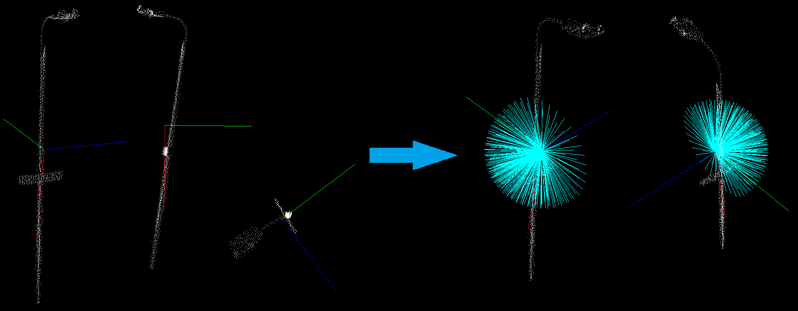
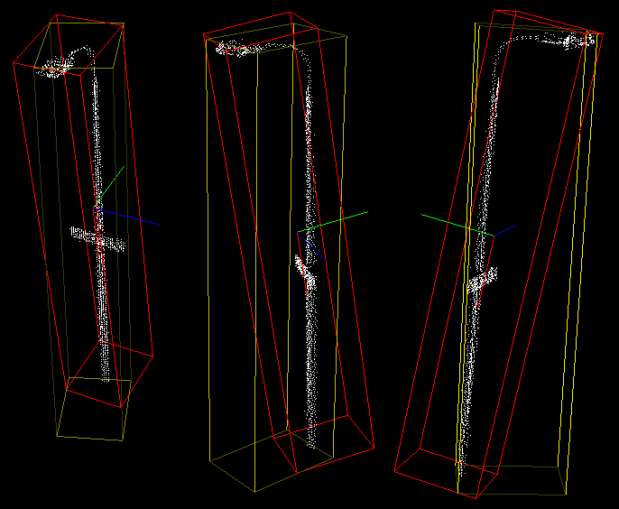

.. _regression:

Regression based descriptors
----------------------------------------------------

In this tutorial we will learn how to use the `pcl::RegressionEstimation` class in order to obtain descriptors based on
statistical regression. This class also allows to extract axis aligned and oriented bounding boxes of the cloud.
But keep in mind that extracted OBB is not the minimal possible bounding box.

Theoretical Primer
------------------

The idea of the feature extraction method is as follows.
Of the given point cloud first a center of mass is calculated (considering mass density uniform and unitary). After that
the best fit plane (mean square minimized error) with equation z=a*x+b*y+c is calculated with a statistical regression method.
Associated to this plane major middle and minor regression vectors are calculated.
You can consider that the resultant regression vectors are applied to the center of mass and are normalized.
They form the right-handed coordinate system applied to the center of mass
(major vector represents X-axis and the minor vector represents Z-axis) with the minor vector normal to the best fit plane
and the other two vectors on the plane.

Implemented class also provides methods for getting AABB and OBB. Oriented bounding box is computed along regression vectors.

The code
--------

First of all you will need the point cloud for this tutorial.
`This <https://github.com/PointCloudLibrary/data/blob/master/tutorials/min_cut_segmentation_tutorial.pcd>`_ is the one presented on the screenshots.
Next what you need to do is to create a file ``regression.cpp`` in any editor you prefer and copy the following code inside of it:

.. literalinclude:: sources/regression/regression.cpp
   :language: cpp
   :linenos:

The explanation
---------------

Now let's study out what is the purpose of this code. First few lines will be omitted, as they are obvious.

.. literalinclude:: sources/regression/regression.cpp
   :language: cpp
   :lines: 16-18

These lines are simply loading the cloud from the .pcd file.

.. literalinclude:: sources/regression/regression.cpp
   :language: cpp
   :lines: 20-22

Here is the line where the instantiation of the ``pcl::RegressionEstimation`` class takes place.
Immediately after that we set the input cloud and start the computational process, that easy.

.. literalinclude:: sources/regression/regression.cpp
   :language: cpp
   :lines: 24-34

This is were we declare all necessary variables needed to store descriptors and bounding boxes.

.. literalinclude:: sources/regression/regression.cpp
   :language: cpp
   :lines: 36-42

These lines show how to access computed descriptors and other features.

.. literalinclude:: sources/regression/regression.cpp
   :language: cpp
   :lines: 44-50

These lines simply create the instance of ``PCLVisualizer`` class for result
visualization. Here we also add the cloud and the AABB for visualization. We
set rendering properties so that the cube is displayed using a wireframe,
because the default is to use a solid cube.

.. literalinclude:: sources/regression/regression.cpp
   :language: cpp
   :lines: 52-55

Visualization of the OBB is little more complex. So here we create a quaternion from the rotational matrix, set OBBs position
and pass it to the visualizer.

.. literalinclude:: sources/regression/regression.cpp
   :language: cpp
   :lines: 57-63

These lines are responsible for vectors visualization. The few lines that
are left simply launch the visualization process.

Compiling and running the program
---------------------------------

Add the following lines to your CMakeLists.txt file:

.. literalinclude:: sources/regression/CMakeLists.txt
   :language: cmake
   :linenos:

After you have made the executable, you can run it. Simply do::

  $ ./moment_of_inertia lamppost.pcd

You should see something similar to this image. Here AABB is yellow, OBB is red. You can also see the vectors.

