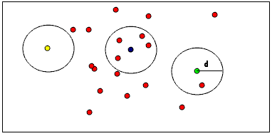

.. _remove_outliers:

Removing outliers using a Conditional or RadiusOutlier removal
--------------------------------------------------------------

This document demonstrates how to remove outliers from a PointCloud using several different methods in the filter module.  First we will look at how to use a ConditionalRemoval filter which removes all indices in the given input cloud that do not satisfy one or more given conditions.  Then we will learn how to us a RadiusOutlierRemoval filter which removes all indices in it's input cloud that don't have at least some number of neighbors within a certain range.

The code
--------

First, create a file, let's say, ``remove_outliers.cpp`` in your favorite
editor, and place the following inside it:

.. literalinclude:: sources/remove_outliers/remove_outliers.cpp
   :language: cpp
   :linenos:

RadiusOutlierRemoval Background
-------------------------------

The picture below helps to visualize what the RadiusOutlierRemoval filter object does.  The user specifies a number of neighbors which every indice must have within a specified radius to remain in the PointCloud.  For example if 1 neighbor is specified, only the yellow point will be removed from the PointCloud.  If 2 neighbors are specified then both the yellow and green points will be removed from the PointCloud.

ConditionalRemoval Background
-----------------------------

Not much to explain here, this filter object removes all points from the PointCloud that do not satisfy one or more conditions that are specified by the user.

The explanation
---------------

Let's break down the code piece by piece.

Some of the code in all 3 of these files is the exact same, so I will only explain what it does once.

Initially the program ensures that the user has specified a command line argument:

.. literalinclude:: sources/remove_outliers/remove_outliers.cpp
   :language: cpp
   :lines: 9-13

In the following lines, we first define the PointCloud structures and fill one of them with random points:

.. literalinclude:: sources/remove_outliers/remove_outliers.cpp
   :language: cpp
   :lines: 14-27

Here is where things are a little bit different depending on which filter class is being used -- an if statement involving the command line options divides the program flow.

For the *RadiusOutlierRemoval*, the user must specify '-r' as the command line argument so that this code is executed:

.. literalinclude:: sources/remove_outliers/remove_outliers.cpp
   :language: cpp
   :lines: 29-37

Basically, we create the RadiusOutlierRemoval filter object, set its parameters and apply it to our input cloud.  The radius of search is set to 0.8, and a point must have a minimum of 2 neighbors in that radius to be kept as part of the PointCloud.

For the *ConditionalRemoval* class, the user must specify '-c' as the command line argument so that this code is executed:

.. literalinclude:: sources/remove_outliers/remove_outliers.cpp
   :language: cpp
   :lines: 38-52

Basically, we create the condition which a given point must satisfy for it to remain in our PointCloud.  In this example, we use add two comparisons to the conditon: greater than (GT) 0.0 and less than (LT) 0.8.  This condition is then used to build the filter. 

In both cases the code above creates the filter object that we are going to use and sets certain parameters that are necessary for the filtering to take place.

The following code just outputs PointCloud before filtering and then after applying whatever filter object is used:

.. literalinclude:: sources/remove_outliers/remove_outliers.cpp
   :language: cpp
   :lines: 57-67

Compiling and running remove_outliers.cpp
---------------------------------------------

Add the following lines to your CMakeLists.txt file:

.. literalinclude:: sources/remove_outliers/CMakeLists.txt
   :language: cmake
   :linenos:
   
After you have made the executable, you can run it.  If you would like to use ConditionalRemoval then simply do::

  $ ./remove_outliers -c

Otherwise, if you would like to use RadiusOutlierRemoval, simply do::

  $ ./remove_outliers -r

You will see something similar to (depending on which filter you are using)::

	Cloud before filtering: 
	    0.352222 -0.151883 -0.106395
	    -0.397406 -0.473106 0.292602
	    -0.731898 0.667105 0.441304
	    -0.734766 0.854581 -0.0361733
	    -0.4607 -0.277468 -0.916762
	Cloud after filtering: 
	    -0.397406 -0.473106 0.292602
	    -0.731898 0.667105 0.441304

