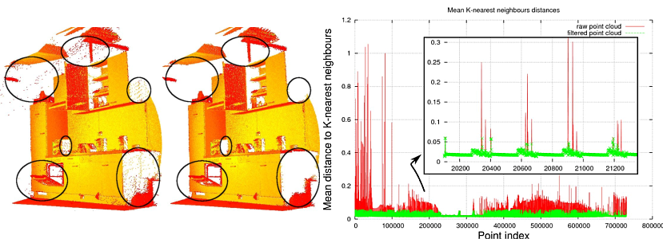

.. _remove_outliers:

Removing outliers using a filter
--------------------------------

This document demonstrates how to remove outliers from a PointCloud using several different methods in the filter module.  First we will look at how to use a ConditionalRemoval filter which removes all indices in the given input cloud that do not satisfy one or more given conditions.  Then we will learn how to us a RadiusOutlierRemoval filter which removes all indices in it's input cloud that don't have at least some number of neighbors within a certain range.  And lastly we will go over how to use the StatisticalOutlierRemoval filter.

ConditionalRemoval
------------------

First, create a file, let's say, ``conditional_removal.cpp`` in your favorite
editor, and place the following inside it:

.. literalinclude:: sources/conditional_removal/conditional_removal.cpp
   :language: cpp
   :linenos:

Now click :ref:`here <explanation>`.

RadiusOutlierRemoval
--------------------

First, create a file, let's say, ``radius_outlier_removal.cpp`` in your favorite
editor, and place the following inside it:

.. literalinclude:: sources/radius_outlier_removal/radius_outlier_removal.cpp
   :language: cpp
   :linenos:

Background
----------

The picture below helps to visualize what the RadiusOutlierRemoval filter object does.  The user specifies a number of neighbors which every indice must have within a specified radius to remain in the PointCloud.  For example if 1 neighbor is specified, only the yellow point will be removed from the PointCloud.  If 2 neighbors are specified then both the yellow and green points will be removed from the PointCloud.

.. image:: images/radius_outlier.png

Now click :ref:`here <explanation>`.

StatisticalOutlierRemoval
-------------------------

First, download the dataset `table_scene_lms400.pcd
<http://dev.pointclouds.org/attachments/download/157/table_scene_lms400.pcd>`_
and save it somewhere to disk.

Then, create a file, let's say, ``statistical_removal.cpp`` in your favorite
editor, and place the following inside it:

.. literalinclude:: sources/statistical_removal/statistical_removal.cpp
   :language: cpp
   :linenos:

.. raw:: html
  
  <iframe title="Removing outliers using a StatisticalOutlierRemoval filter" width="480" height="390" src="http://www.youtube.com/embed/RjQPp2_GRnI?rel=0" frameborder="0" allowfullscreen></iframe>

Background
----------

Laser scans typically generate point cloud datasets of varying point densities.
Additionally, measurement errors lead to sparse outliers which corrupt the
results even more.  This complicates the estimation of local point cloud
characteristics such as surface normals or curvature changes, leading to
erroneous values, which in turn might cause point cloud registration failures.
Some of these irregularities can be solved by performing a statistical analysis
on each point's neighborhood, and trimming those which do not meet a certain
criteria.  Our sparse outlier removal is based on the computation of the
distribution of point to neighbors distances in the input dataset. For each
point, we compute the mean distance from it to all its neighbors. By assuming
that the resulted distribution is Gaussian with a mean and a standard
deviation, all points whose mean distances are outside an interval defined by
the global distances mean and standard deviation can be considered as outliers
and trimmed from the dataset.

The following picture show the effects of the sparse outlier analysis and
removal: the original dataset is shown on the left, while the resultant one on
the right. The graphic shows the mean k-nearest neighbor distances in a point
neighborhood before and after filtering.

.. _explanation:

The explanation
---------------

Let's break down the code piece by piece.

Some of the code in all 3 of these files is the exact same, so I will only explain what it does once.

In the following lines, we first define the PointCloud structures:

.. literalinclude:: sources/conditional_removal/conditional_removal.cpp
   :language: cpp
   :lines: 8-9

Here is where things are a little bit different depending on which filter class you are using.
For both *ConditionalRemoval* and *RadiusOutlierRemoval*, we will fill in the input cloud with random points, and display it's content to screen:

.. literalinclude:: sources/conditional_removal/conditional_removal.cpp
   :language: cpp
   :lines: 11-27

For the *StatisticalOutlierRemoval*, we do not fill the cloud with random points, instead we use data from a file.  The following lines of code will read the point cloud data from disk.

.. literalinclude:: sources/statistical_removal/statistical_removal.cpp
   :language: cpp
   :lines: 12-15

And then click :ref:`here <statistical_removal>`.

From here we now need to build the filter we are using and apply it to the original PointCloud.

If using RadiusOutlierRemoval click :ref:`here <radius_removal>`, otherwise continue below.

Building ConditionalRemoval filter
----------------------------------

After creating and filling our input cloud, we create the condition which a given point must satisfy for it to remain in our PointCloud.  To do this we must add two comparisons to the conditon.  We are going to use greater than 0.0, and less than 0.8.  This condition is then used to build the filter. 

.. literalinclude:: sources/conditional_removal/conditional_removal.cpp
   :language: cpp
   :lines: 28-39

Now click :ref:`here <apply_filter>`.

.. _radius_removal:

Building RadiusOutlierRemoval filter
------------------------------------

Then, we create the RadiusOutlierRemoval filter object, set it's parameters and apply it to our input cloud.  The radius of search is set to 0.8, and a point must have a minimum of 2 neighbors in that radius to be kept as part of the PointCloud.

.. literalinclude:: sources/radius_outlier_removal/radius_outlier_removal.cpp
   :language: cpp
   :lines: 29-35

Now click :ref:`here <apply_filter>`.

Building StatisticalOutlierRemoval filter
-----------------------------------------

Then, a *pcl::StatisticalOutlierRemoval* filter is created. The number of
neighbors to analyze for each point is set to 50, and the standard deviation
multiplier to 1. What this means is that all points who have a distance larger
than 1 standard deviation of the mean distance to teh query point will be
marked as outliers and removed. The output is computed and stored in
*cloud_filtered*.

.. literalinclude:: sources/statistical_removal/statistical_removal.cpp
   :language: cpp
   :lines: 20-25

   
The remaining data (inliers) is written to disk for later inspection. 

.. literalinclude:: sources/statistical_removal/statistical_removal.cpp
   :language: cpp
   :lines: 30-31

   
Then, the filter is called with the same parameters, but with the output
negated, to obtain the outliers (e.g., the points that were filtered).

.. literalinclude:: sources/statistical_removal/statistical_removal.cpp
   :language: cpp
   :lines: 33-34

   
And the data is written back to disk.

.. literalinclude:: sources/statistical_removal/statistical_removal.cpp
   :language: cpp
   :lines: 35
   
.. _apply_filter:

The last bit of code just applies the filter object we've created to our original PointCloud and removes all points that do not satisfy the parameters specified for the filter.  Then it displays all of the points remaining in the PointCloud.

.. literalinclude:: sources/conditional_removal/conditional_removal.cpp
   :language: cpp
   :lines: 41-48

Compiling and running conditional_removal.cpp
---------------------------------------------

Add the following lines to your CMakeLists.txt file:

.. literalinclude:: sources/conditional_removal/CMakeLists.txt
   :language: cmake
   :linenos:

After you have made the executable, you can run it. Simply do::

  $ ./conditioinal_removal

You will see something similar to::

  Cloud before filtering:
		0.352222 -0.151883 -0.106395
	   -0.397406 -0.473106 0.292602
		-0.731898 0.667105 0.441304
		-0.734766 0.854581 -0.0361733
		-0.4607 -0.277468 -0.916762
  Cloud after filtering: 
		-0.397406 -0.473106 0.292602
		-0.731898 0.667105 0.441304

Compiling and running radius_outlier_removal.cpp
------------------------------------------------

Add the following lines to your CMakeLists.txt file:

.. literalinclude:: sources/radius_outlier_removal/CMakeLists.txt
   :language: cmake
   :linenos:

After you have made the executable, you can run it. Simply do::

  $ ./conditioinal_removal

You will see something similar to::

  Cloud before filtering: 
       0.352222 -0.151883 -0.106395
	   -0.397406 -0.473106 0.292602
	   -0.731898 0.667105 0.441304
	   -0.734766 0.854581 -0.0361733
	   -0.4607 -0.277468 -0.916762
  Cloud after filtering: 
	   -0.731898 0.667105 0.441304
	   -0.734766 0.854581 -0.0361733

Compiling and running statistical_outlier.cpp
---------------------------------------------

Add the following lines to your CMakeLists.txt file:

.. literalinclude:: sources/statistical_removal/CMakeLists.txt
   :language: cmake
   :linenos:
   
After you have made the executable, you can run it. Simply do::

  $ ./statistical_removal

You will see something similar to::

  Cloud before filtering: 
  header: 
  seq: 0
  stamp: 0.000000000
  frame_id: 
  points[]: 460400
  width: 460400
  height: 1
  is_dense: 0

  Cloud after filtering: 
  header: 
  seq: 0
  stamp: 0.000000000
  frame_id: 
  points[]: 429398
  width: 429398
  height: 1
  is_dense: 0

