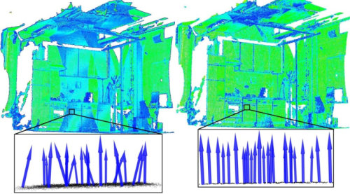
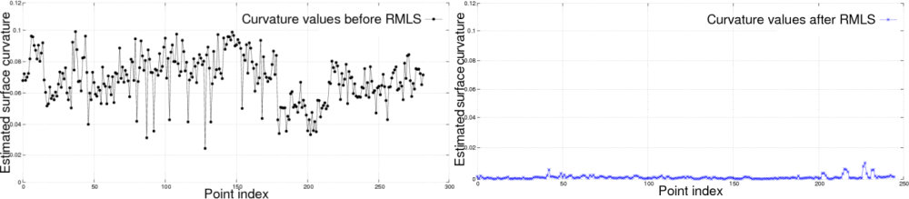

.. _moving_least_squares:

Smoothing and normal estimation based on polynomial reconstruction
------------------------------------------------------------------

This tutorial explains how a Moving Least Squares (MLS) surface reconstruction
method can be used to smooth and resample noisy data. Please see an example in
the video below:

.. raw:: html

   <iframe title="Smoothing and normal estimation based on polynomial reconstruction" width="480" height="390" src="https://www.youtube.com/embed/FqHroDuo_I8?rel=0" frameborder="0" allowfullscreen></iframe>

Some of the data irregularities (caused by small distance measurement errors)
are very hard to remove using statistical analysis. To create complete models,
glossy surfaces as well as occlusions in the data must be accounted for. In
situations where additional scans are impossible to acquire, a solution is to
use a resampling algorithm, which attempts to recreate the missing parts of the
surface by higher order polynomial interpolations between the surrounding data
points. By performing resampling, these small errors can be corrected and the
"double walls" artifacts resulted from registering multiple scans together can
be smoothed. 

On the left side of the figure above, we see the effect of estimating surface
normals in a dataset comprised of two registered point clouds together. Due to
alignment errors, the resultant normals are noisy. On the right side we see the
effects of surface normal estimation in the same dataset after it has been
smoothed with a Moving Least Squares algorithm. Plotting the curvatures at each
point as a measure of the eigenvalue relationship before and after resampling,
we obtain:

To approximate the surface defined by a local neighborhood of points 
**p1**, **p2** ... **pk** at a point **q** we use a bivariate polynomial height function
defined on a robustly computed reference plane. 

.. raw:: html

   <iframe title="Removing noisy data through resampling" width="480" height="390" src="https://www.youtube.com/embed/N5AgC0KEcw0?rel=0" frameborder="0" allowfullscreen></iframe>

The code
--------

First, download the dataset `bun0.pcd
<https://raw.githubusercontent.com/PointCloudLibrary/pcl/master/test/bun0.pcd>`_
and save it somewhere to disk.

Then, create a file, let's say, ``resampling.cpp`` in your favorite
editor, and place the following inside it:

.. literalinclude:: sources/resampling/resampling.cpp
   :language: cpp
   :linenos:

You should be able to find the input file at *pcl/test/bun0.pcd*.

The explanation
---------------

Now, let's break down the code piece by piece.

.. literalinclude:: sources/resampling/resampling.cpp
   :language: cpp
   :lines: 10-12

   
as the example PCD has only XYZ coordinates, we load it into a
PointCloud<PointXYZ>. These fields are mandatory for the method, other ones are
allowed and will be preserved.

.. literalinclude:: sources/resampling/resampling.cpp
   :language: cpp
   :lines: 23

if normal estimation is not required, this step can be skipped.

.. literalinclude:: sources/resampling/resampling.cpp
   :language: cpp
   :lines: 21

the first template type is used for the input and output cloud. Only the XYZ
dimensions of the input are smoothed in the output.

.. literalinclude:: sources/resampling/resampling.cpp
   :language: cpp
   :lines: 27

   
polynomial fitting could be disabled for speeding up smoothing. Please consult
the code API (:pcl:`MovingLeastSquares <pcl::MovingLeastSquares>`) for default
values and additional parameters to control the smoothing process.

.. literalinclude:: sources/resampling/resampling.cpp
   :language: cpp
   :lines: 34-36

   
if the normals and the original dimensions need to be in the same cloud, the
fields have to be concatenated.

Compiling and running the program
---------------------------------

Add the following lines to your CMakeLists.txt file:

.. literalinclude:: sources/resampling/CMakeLists.txt
   :language: cmake
   :linenos:

After you have made the executable, you can run it. Simply do::

  $ ./resampling

You can view the smoothed cloud for example by executing::

  $ pcl_viewer bun0-mls.pcd

