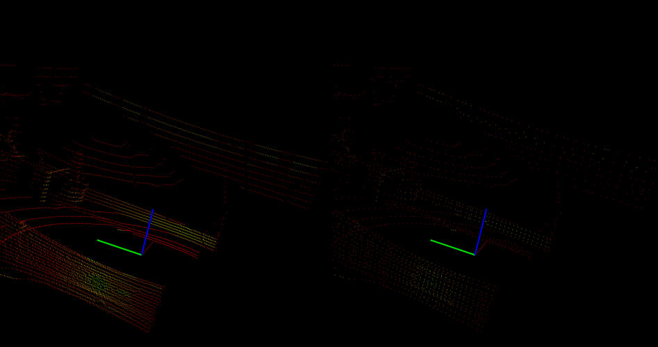

.. _sphericalvoxelgrid:

Downsampling a PointCloud using a SphericalVoxelGrid filter
-----------------------------------------------------------

In this tutorial, we will use a modified VoxelGrid to downsample
a point cloud using spherical coordinates. This method allows the
user to selectively modify the resolution of point clouds produced
by modern 3D LiDAR scanners. The use of spherical coordinates permits
the radial and angular resolutions of the cloud to be downsampled
independently, which is not possible in a cartesian system.

The code
--------

First, download the dataset `spherical_voxel_grid_example.pcd
<https://raw.github.com/PointCloudLibrary/data/master/tutorials/spherical_voxel_grid_example.pcd>`_
and save it somewhere to disk.

Then, create a file, let's say, ``spherical_voxel_grid.cpp`` in your favorite
editor, and place the following inside it:

.. literalinclude:: sources/spherical_voxel_grid/spherical_voxel_grid.cpp
   :language: cpp
   :linenos:

The explanation
---------------

Now, let's break down the code piece by piece.

The following line of code will read the point cloud data from disk.

.. literalinclude:: sources/voxel_grid/voxel_grid.cpp
   :language: cpp
   :lines: 12-12
   
Then, a *pcl::SphericalVoxelGrid* filter is created with a radial leaf size of 10cm, 90 vertical angular
divisions, and 300 horizontal angular divisions. The input data is passed, and the output is computed
and stored in *output*.

.. literalinclude:: sources/voxel_grid/voxel_grid.cpp
   :language: cpp
   :lines: 16-20
   
Finally, the data is written to disk for later inspection.

.. literalinclude:: sources/voxel_grid/voxel_grid.cpp
   :language: cpp
   :lines: 24-24

Compiling and running the program
---------------------------------

Add the following lines to your CMakeLists.txt file:

.. literalinclude:: sources/voxel_grid/CMakeLists.txt
   :language: cmake
   :linenos:
   
After you have made the executable, you can run it. Simply do::

  $ ./spherical_voxel_grid

You will see something similar to::

  Size before downsample: 9074
  Size after downsample: 3374

The downsampled point cloud will look similar to this::

:alt: Spherical Voxel Grid Example: Original (left), Downsampled (right)
   :align: center
