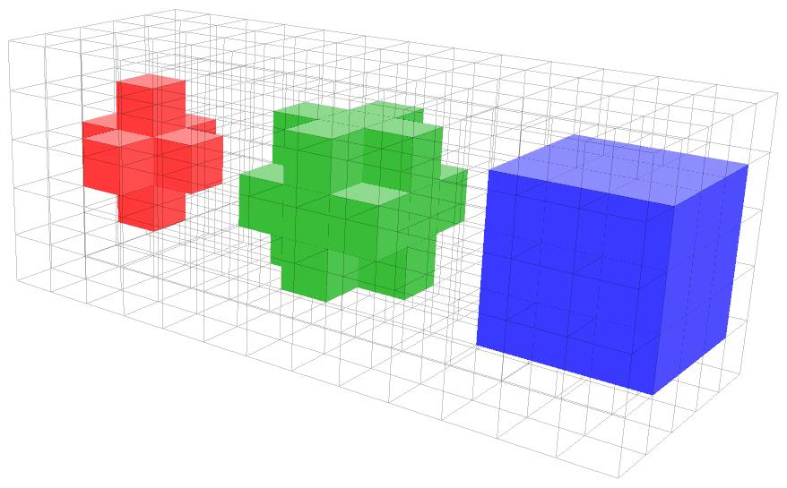
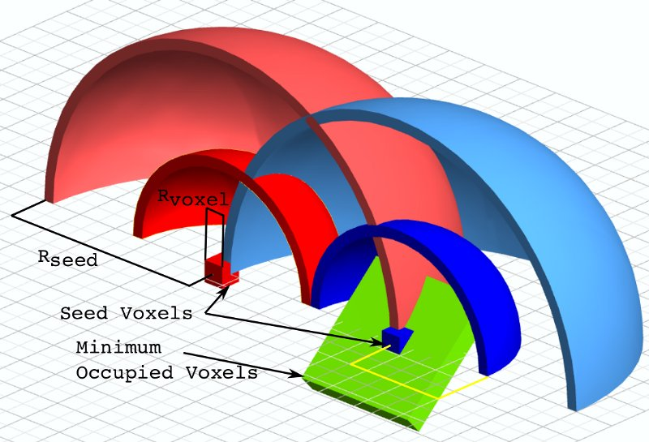
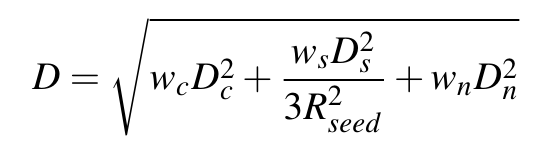
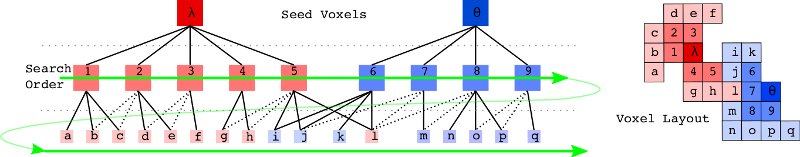

.. _supervoxel_clustering:

Clustering of Pointclouds into Supervoxels - Theoretical primer
---------------------------------------------------------------

In this tutorial, we show how to divide a pointcloud into a number of supervoxel clusters using ``pcl::SupervoxelClustering``, and then how to use and visualize the adjacency information and supervoxels themselves.

   **An example of supervoxels and adjacency graph generated for a cloud**

Segmentation algorithms aim to group pixels in images into perceptually meaningful regions which conform to object boundaries. Graph-based approaches, such as Markov Random Field (MRF) and Conditional Random Field (CRF), have become popular, as they merge relational low-level context within the image with object level class knowledge. The cost of solving pixel-level graphs led to the development of mid-level inference schemes which do not use pixels directly, but rather use groupings of pixels, known as superpixels, as the base level for nodes. Superpixels are formed by over-segmenting the image into small regions based on local low-level features, reducing the number of nodes which must be considered for inference. 

Due to their strong impact on the quality of the eventual segmentation, it is important that superpixels have certain characteristics. Of these, avoiding violating object boundaries is the most vital, as failing to do so will decrease the accuracy of classifiers used later - since they will be forced to consider pixels which belong to more than one class. Additionally, even if the classifier does manage a correct output, the final pixel level segmentation will necessarily contain errors. Another useful quality is regular distribution over the area being segmented, as this will produce a simpler graph for later steps.

Voxel Cloud Connectivity Segmentation (VCCS) is a recent "superpixel" method which generates volumetric over-segmentations of 3D point cloud data, known as supervoxels. Supervoxels adhere to object boundaries better than state-of-the-art 2D methods, while remaining efficient enough to use in online applications. VCCS uses a region growing variant of k-means clustering for generating its labeling of points directly within a voxel octree structure. Supervoxels have two important properties; they are evenly distributed across the 3D space, and they cannot cross boundaries unless the underlying voxels are spatial connected. The former is accomplished by seeding supervoxels directly in the cloud, rather than the projected plane, while the latter uses an octree structure which maintains adjacency information of leaves. Supervoxels maintain adjacency relations in voxelized 3D space; specifically, 26-adjacency- that is neighboring voxels are those that share a face, edge, or vertex, as seen below. 

   **From right to left, 6 (faces), 18 (faces,egdes), and 26 (faces, edges, vertices) adjacency**

The adjacency graph of supervoxels (and the underlying voxels) is maintained efficiently within the octree by specifying that neighbors are voxels within R_voxel of one another, where R_voxel specifies the octree leaf resolution. This adjacency graph is used extensively for both the region growing used to generate the supervoxels, as well as determining adjacency of the resulting supervoxels themselves.

VCCS is a region growing method which incrementally expand supervoxels from a set of seed points distributed evenly in space on a grid with resolution R_seed. To maintain efficiency, VCCS does not search globally, but rather only considers points within R_seed of the seed center. Additionally, seeds which are isolated are filtered out by establishing a small search radius R_search around each seed and removing seeds which do not have sufficient neighbor voxels connected to them. 

   **The various sizing parameters which affect supervoxel clustering. R_seed and R_voxel must both be set by the user.**

Expansion from the seed points is governed by a distance measure calculated in a feature space consisting of spatial extent, color, and normals. The spatial distance D_s is normalized by the seeding resolution, color distance D_c is the euclidean distance in normalized RGB space, and normal distance D_n measures the angle between surface normal vectors.

   **Weighting equation used in supervoxel clustering. w_c, w_s, and w_n, the color, spatial, and normal weights, respectively, are user controlled parameters.**

Supervoxels are grown iteratively, using a local k-means clustering which considers connectivity and flow. The general process is as follows. Beginning at the voxel nearest the cluster center, we flow outward to adjacent voxels and compute the distance from each of these to the supervoxel center using the distance equation above. If the distance is the smallest this voxel has seen, its label is set, and using the adjacency graph, we add its neighbors which are further from the center to our search queue for this label. We then proceed to the next supervoxel, so that each level outwards from the center is considered at the same time for all supervoxels (a 2d version of this is seen in the figure below). We proceed iteratively outwards until we have reached the edge of the search volume for each supervoxel (or have no more neighbors to check).

   **Search order in the adjacency octree for supervoxel cluster expansion. Dotted edges in the adjacency graph are not searched, since they have already been considered earlier in the queue.**

Alright, let's get to the code... but if you want further details on how supervoxels work (and if you use them in an academic work) please reference the following publication::

  @InProceedings{Papon13CVPR,
    author={Jeremie Papon and Alexey Abramov and Markus Schoeler and Florentin W\"{o}rg\"{o}tter},
    title={Voxel Cloud Connectivity Segmentation - Supervoxels for Point Clouds},
    booktitle={Computer Vision and Pattern Recognition (CVPR), 2013 IEEE Conference on},
    month     = {June 22-27},
    year      = {2013},
    address   = {Portland, Oregon},
  }

Oh, and for a more complicated example which uses Supervoxels, see ``pcl/examples/segmentation/supervoxel_clustering.cpp``. 

The code
--------
First, grab a pcd file made from a kinect or similar device - here we shall use ``milk_cartoon_all_small_clorox.pcd`` which is available in the pcl git :download:`here <http://github.com/PointCloudLibrary/pcl/blob/master/test/milk_cartoon_all_small_clorox.pcd?raw=true>`).

Next, copy and paste the following code into your editor and save it as ``supervoxel_clustering.cpp`` (or download the source file :download:`here <./sources/supervoxel_clustering/supervoxel_clustering.cpp>`).

.. literalinclude:: sources/supervoxel_clustering/supervoxel_clustering.cpp
   :language: cpp
   :linenos:

The explanation
---------------

We start by defining convenience types in order not to clutter the code.

.. literalinclude:: sources/supervoxel_clustering/supervoxel_clustering.cpp
   :language: cpp
   :lines: 9-14

Then we load the input cloud based on the input argument

.. literalinclude:: sources/supervoxel_clustering/supervoxel_clustering.cpp
   :language: cpp
   :lines: 36-42

Next we check the input arguments and set default values. You can play with the various parameters to see how they affect the supervoxels, but briefly:

- ``--NT`` Disables the single-view transform (this is necessary if you are loading a cloud constructed from more than one viewpoint)
- ``-v`` Sets the voxel size, which determines the leaf size of the underlying octree structure (in meters)
- ``-s`` Sets the seeding size, which determines how big the supervoxels will be (in meters)
- ``-c`` Sets the weight for color - how much color will influence the shape of the supervoxels
- ``-z`` Sets the weight for spatial term - higher values will result in supervoxels with very regular shapes (lower will result in supervoxels which follow normals and/or colors, but are not very regular)
- ``-n`` Sets the weight for normal - how much surface normals will influence the shape of the supervoxels

.. literalinclude:: sources/supervoxel_clustering/supervoxel_clustering.cpp
   :language: cpp
   :lines: 45-67

We are now ready to setup the supervoxel clustering. We use the class :pcl:`SupervoxelClustering <pcl::SupervoxelClustering>`, which implements the clustering process and give it the parameters.

.. important::

  You MUST set use_transform to false if you are using a cloud which doesn't have the camera at (0,0,0). The transform is specifically designed to help improve Kinect data by increasing voxel bin size as distance from the camera increases. If your data is artificial, made from combining multiple clouds from cameras at different viewpoints, or doesn't have the camera at (0,0,0), the transform MUST be set to false. 

.. literalinclude:: sources/supervoxel_clustering/supervoxel_clustering.cpp
   :language: cpp
   :lines: 73-77

Then we initialize the data structure which will be used to extract the supervoxels, and run the algorithm. The data structure is a map from labels to shared pointers of :pcl:`Supervoxel <pcl::Supervoxel>` templated on the input point type. Supervoxels have the following fields:

- ``normal_`` The normal calculated for the voxels contained in the supervoxel
- ``centroid_`` The centroid of the supervoxel - average voxel
- ``voxels_`` A Pointcloud of the voxels in the supervoxel
- ``normals_`` A Pointcloud of the normals for the points in the supervoxel

.. literalinclude:: sources/supervoxel_clustering/supervoxel_clustering.cpp
   :language: cpp
   :lines: 79-83

We then load a viewer and use some of the getter functions of :pcl:`SupervoxelClustering <pcl::SupervoxelClustering>` to pull out clouds to display. ``voxel_centroid_cloud`` contains the voxel centroids coming out of the octree (basically the downsampled original cloud), and ``colored_voxel_cloud`` are the voxels colored according to their supervoxel labels (random colors). ``sv_normal_cloud`` contains a cloud of the supervoxel normals, but we don't display it here so that the graph is visible.

.. literalinclude:: sources/supervoxel_clustering/supervoxel_clustering.cpp
   :language: cpp
   :lines: 85-99

Finally, we extract the supervoxel adjacency list (in the form of a multimap of label adjacencies).

.. literalinclude:: sources/supervoxel_clustering/supervoxel_clustering.cpp
   :language: cpp
   :lines: 101-103

Then we iterate through the multimap, creating a point cloud of the centroids of each supervoxel's neighbors. 

.. literalinclude:: sources/supervoxel_clustering/supervoxel_clustering.cpp
   :language: cpp
   :lines: 105-120

Then we create a string label for the supervoxel graph we will draw and call ``addSupervoxelConnectionsToViewer``, a drawing helper function implemented later in the tutorial code. The details of ``addSupervoxelConnectionsToViewer`` are beyond the scope of this tutorial, but all it does is draw a star polygon mesh of the supervoxel centroid to all of its neighbors centroids. We need to do this like this because adding individual lines using the ``addLine`` functionality of ``pcl_visualizer`` is too slow for large numbers of lines.

.. literalinclude:: sources/supervoxel_clustering/supervoxel_clustering.cpp
   :language: cpp
   :lines: 121-127

This results in a supervoxel graph that looks like this for seed size of 0.1m (top) and 0.05m (middle). The bottom is the original cloud, given for reference.:

Compiling and running the program
---------------------------------

Create a ``CMakeLists.txt`` file with the following content (or download it :download:`here <./sources/supervoxel_clustering/CMakeLists.txt>`):

.. literalinclude:: sources/supervoxel_clustering/CMakeLists.txt
   :language: cmake
   :linenos:

After you have made the executable, you can run it like so, assuming the pcd file is in the same folder as the executable::

  $ ./supervoxel_clustering milk_cartoon_all_small_clorox.pcd

Don't be afraid to play around with the parameters (especially the seed size, -s) to see what happens. The pcd file name should always be the first parameter!
