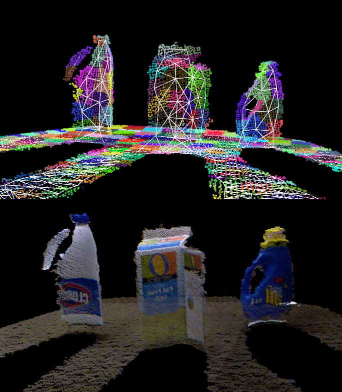
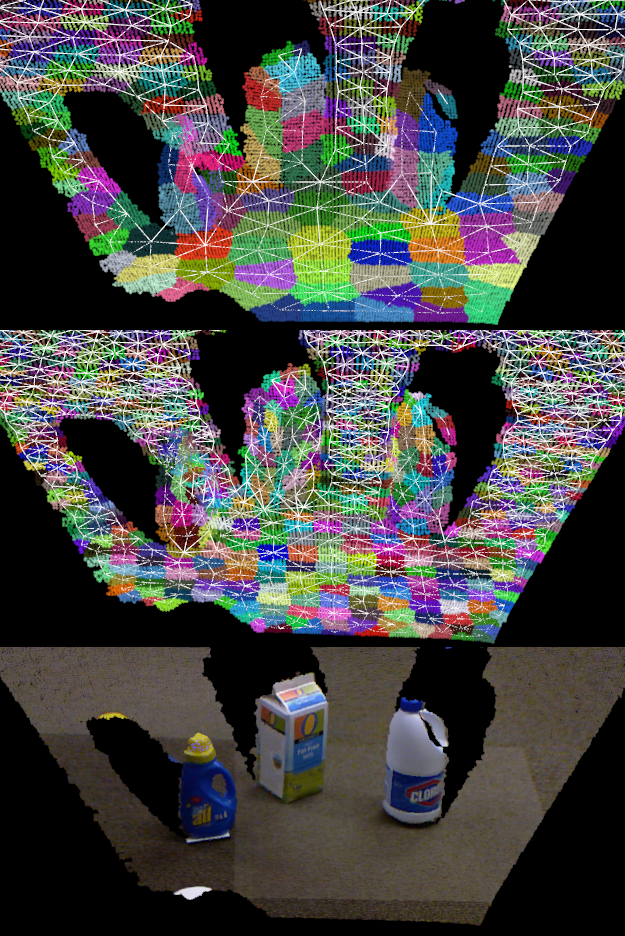

.. _supervoxel_clustering:

Clustering of Pointclouds into Supervoxels
---------------------------------------

In this tutorial, we show how to divide a pointcloud into a number of supervoxel clusters using ``pcl::SupervoxelClustering``, and then how to use and visualize the adjacency information and supervoxels themselves.

To create supervoxel clusters, we use Voxel Cloud Connectivity Segmentation (VCCS), a full 3D over-segmentation algorithm developed to use as the basis for higher-level semantic segmentation and predictive tracking. It uses voxel relationships to produce over-segmentations (supervoxels - the 3d analogue of superpixels). Supervoxels adhere to object boundaries better than state-of-the-art 2D methods, while remaining efficient enough to use in online applications. VCCS uses a region growing variant of k-means clustering for generating its labeling of points directly within a voxel octree structure (``pcl::octree::OctreePointCloudAdjacency``). Supervoxels have two important properties; they are evenly distributed across the 3D space, and they cannot cross boundaries unless the underlying voxels are spatially connected. The former is accomplished by seeding supervoxels directly in the cloud, rather than the projected plane, while the latter uses an octree structure which maintains adjacency information of leaves.

For a more complicated example which uses Supervoxels, see ``pcl/examples/segmentation/supervoxel_clustering.cpp``. For further details on how supervoxels work (and if you use them in an academic work) please reference the following publication::

  @InProceedings{Papon13CVPR,
    author={Jeremie Papon and Alexey Abramov and Markus Schoeler and Florentin W\"{o}rg\"{o}tter},
    title={Voxel Cloud Connectivity Segmentation - Supervoxels for Point Clouds},
    booktitle={Computer Vision and Pattern Recognition (CVPR), 2013 IEEE Conference on},
    month     = {June 22-27},
    year      = {2013},
    address   = {Portland, Oregon},
  }

The code
--------
First, grab a pcd file made from a kinect or similar device - here we shall use ``milk_cartoon_all_small_clorox.pcd`` which is available in the pcl trunk :download:`here <http://github.com/PointCloudLibrary/pcl/blob/master/test/milk_cartoon_all_small_clorox.pcd?raw=true>`).

Next, copy and paste the following code into your editor and save it as ``supervoxel_clustering.cpp`` (or download the source file :download:`here <./sources/supervoxel_clustering/supervoxel_clustering.cpp>`).

.. literalinclude:: sources/supervoxel_clustering/supervoxel_clustering.cpp
   :language: cpp
   :linenos:

The explanation
---------------

We start by defining convenience types in order not to clutter the code.

.. literalinclude:: sources/supervoxel_clustering/supervoxel_clustering.cpp
   :language: cpp
   :lines: 9-14

Then we load the input cloud based on the input argument

.. literalinclude:: sources/supervoxel_clustering/supervoxel_clustering.cpp
   :language: cpp
   :lines: 36-42

Next we check the input arguments and set default values. You can play with the various parameters to see how they affect the supervoxels, but briefly:

- ``--NT`` Disables the single-view transform (this is necessary if you are loading a cloud constructed from more than one viewpoint)
- ``-v`` Sets the voxel size, which determines the leaf size of the underlying octree structure (in meters)
- ``-s`` Sets the seeding size, which determines how big the supervoxels will be (in meters)
- ``-c`` Sets the weight for color - how much color will influence the shape of the supervoxels
- ``-z`` Sets the weight for spatial term - higher values will result in supervoxels with very regular shapes (lower will result in supervoxels which follow normals and/or colors, but are not very regular)
- ``-n`` Sets the weight for normal - how much surface normals will influence the shape of the supervoxels

.. literalinclude:: sources/supervoxel_clustering/supervoxel_clustering.cpp
   :language: cpp
   :lines: 45-67

We are now ready to setup the supervoxel clustering. We use the class :pcl:`SupervoxelClustering <pcl::SupervoxelClustering>`, which implements the clustering process and give it the parameters.

.. literalinclude:: sources/supervoxel_clustering/supervoxel_clustering.cpp
   :language: cpp
   :lines: 73-77

Then we initialize the data structure which will be used to extract the supervoxels, and run the algorithm. The data structure is a map from labels to shared pointers of :pcl:`Supervoxel <pcl::Supervoxel>` templated on the input point type. Supervoxels have the following fields:

- ``normal_`` The normal calculated for the voxels contained in the supervoxel
- ``centroid_`` The centroid of the supervoxel - average voxel
- ``voxels_`` A Pointcloud of the voxels in the supervoxel
- ``normals_`` A Pointcloud of the normals for the points in the supervoxel

.. literalinclude:: sources/supervoxel_clustering/supervoxel_clustering.cpp
   :language: cpp
   :lines: 79-83

We then load a viewer and use some of the getter functions of :pcl:`SupervoxelClustering <pcl::SupervoxelClustering>` to pull out clouds to display. ``voxel_centroid_cloud`` contains the voxel centroids coming out of the octree (basically the downsampled original cloud), and ``colored_voxel_cloud`` are the voxels colored according to their supervoxel labels (random colors). ``sv_normal_cloud`` contains a cloud of the supervoxel normals, but we don't display it here so that the graph is visible.

.. literalinclude:: sources/supervoxel_clustering/supervoxel_clustering.cpp
   :language: cpp
   :lines: 85-99

Finally, we extract the supervoxel adjacency list (in the form of a multimap of label adjacencies).

.. literalinclude:: sources/supervoxel_clustering/supervoxel_clustering.cpp
   :language: cpp
   :lines: 101-103

Then we iterate through the multimap, creating a point cloud of the centroids of each supervoxel's neighbors. 

.. literalinclude:: sources/supervoxel_clustering/supervoxel_clustering.cpp
   :language: cpp
   :lines: 105-120

Then we create a string label for the supervoxel graph we will draw and call ``addSupervoxelConnectionsToViewer``, a drawing helper function implemented later in the tutorial code. The details of ``addSupervoxelConnectionsToViewer`` are beyond the scope of this tutorial, but all it does is draw a star polygon mesh of the supervoxel centroid to all of its neighbors centroids. We need to do this like this because adding individual lines using the ``addLine`` functionality of ``pcl_visualizer`` is too slow for large numbers of lines.

.. literalinclude:: sources/supervoxel_clustering/supervoxel_clustering.cpp
   :language: cpp
   :lines: 121-127

This results in a supervoxel graph that looks like this for seed size of 0.1m (top) and 0.05m (middle). The bottom is the original cloud, given for reference.:

Compiling and running the program
---------------------------------

Create a ``CMakeLists.txt`` file with the following content (or download it :download:`here <./sources/supervoxel_clustering/CMakeLists.txt>`):

.. literalinclude:: sources/supervoxel_clustering/CMakeLists.txt
   :language: cmake
   :linenos:

After you have made the executable, you can run it like so, assuming the pcd file is in the same folder as the executable::

  $ ./supervoxel_clustering milk_cartoon_all_small_clorox.pcd

Don't be afraid to play around with the parameters (especially the seed size, -s) to see what happens. The pcd file name should always be the first parameter!
