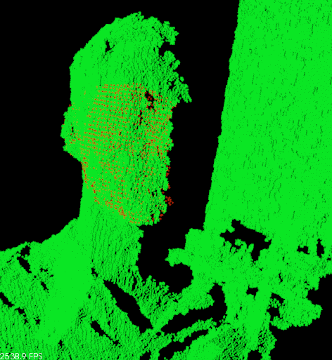
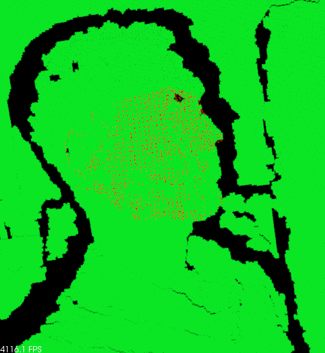
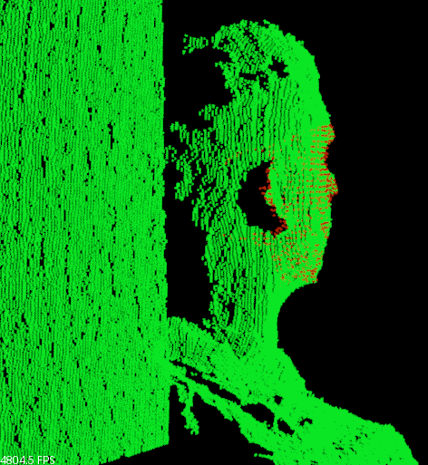

.. _template_alignment:

Aligning object templates to a point cloud
------------------------------------------

This tutorial gives an example of how some of the tools covered in the other tutorials can be combined to solve a higher level problem --- aligning a previously captured model of an object to some newly captured data.  In this specific example, we'll take a depth image that contains a person and try to fit some previously captured templates of their face; this will allow us to determine the position and orientation of the face in the scene.

The code
--------

First, download the dataset `face_templates.tar.gz <http://dev.pointclouds.org/attachments/download/130/template_alignment_data.tar.gz>`_
and extract the files.

Next, `download <http://dev.pointclouds.org/attachments/download/129/template_alignment_src.tar.gz>`_ the source files (``feature_cloud.hpp``, ``template_alignment.hpp``, and ``template_alignment_tutorial.cpp``), or just copy and paste the following code into your editor and save it as ``template_alignment_tutorial.cpp``.

.. code-block:: cpp
  :linenos:

  #include <limits>
  #include <fstream>
  #include <vector>
  #include "Eigen/Core"
  #include "pcl/point_types.h"
  #include "pcl/point_cloud.h"
  #include "pcl/io/pcd_io.h"
  #include "pcl/kdtree/kdtree_flann.h"
  #include "pcl/filters/passthrough.h"
  #include "pcl/filters/voxel_grid.h"
  #include "pcl/features/normal_3d.h"
  #include "pcl/features/fpfh.h"
  #include "pcl/registration/ia_ransac.h"

  class FeatureCloud
  {
  public:
    // A bit of shorthand
    typedef pcl::PointCloud<pcl::PointXYZ> PointCloud;
    typedef pcl::PointCloud<pcl::Normal> SurfaceNormals;
    typedef pcl::PointCloud<pcl::FPFHSignature33> LocalFeatures;
    typedef pcl::KdTreeFLANN<pcl::PointXYZ> SearchMethod;

    FeatureCloud () :
      search_method_xyz_ (new SearchMethod),
      normal_radius_ (0.02), 
      feature_radius_ (0.02)
    {}

    ~FeatureCloud () {}

    // Process the given cloud
    void setInputCloud (PointCloud::Ptr xyz)
    {
      xyz_ = xyz;
      processInput ();
    }

    // Load and process the cloud in the given PCD file
    void loadInputCloud (const std::string & pcd_file)
    {
      xyz_ = PointCloud::Ptr (new PointCloud);
      pcl::io::loadPCDFile (pcd_file, *xyz_);
      processInput ();
    }

    // Get a pointer to the cloud 3D points
    PointCloud::Ptr getPointCloud () const
    {
      return (xyz_);
    }

    // Get a pointer to the cloud of 3D surface normals
    SurfaceNormals::Ptr getSurfaceNormals () const
    {
      return (normals_);
    }

    // Get a pointer to the cloud of feature descriptors
    LocalFeatures::Ptr getLocalFeatures () const
    {
      return (features_);
    }
  
  protected:
    // Compute the surface normals and local features
    void processInput ()
    {
      computeSurfaceNormals ();
      computeLocalFeatures ();
    }

    // Compute the surface normals
    void computeSurfaceNormals ()
    {
      normals_ = SurfaceNormals::Ptr (new SurfaceNormals);

      pcl::NormalEstimation<pcl::PointXYZ, pcl::Normal> norm_est;
      norm_est.setInputCloud (xyz_);
      norm_est.setSearchMethod (search_method_xyz_);
      norm_est.setRadiusSearch (normal_radius_);
      norm_est.compute (*normals_);
    }

    // Compute the local feature descriptors
    void computeLocalFeatures ()
    {
      features_ = LocalFeatures::Ptr (new LocalFeatures);

      pcl::FPFHEstimation<pcl::PointXYZ, pcl::Normal, pcl::FPFHSignature33> fpfh_est;
      fpfh_est.setInputCloud (xyz_);
      fpfh_est.setInputNormals (normals_);
      fpfh_est.setSearchMethod (search_method_xyz_);
      fpfh_est.setRadiusSearch (feature_radius_);
      fpfh_est.compute (*features_);
    }

  private:
    // Point cloud data
    PointCloud::Ptr xyz_;
    SurfaceNormals::Ptr normals_;
    LocalFeatures::Ptr features_;
    SearchMethod::Ptr search_method_xyz_;

    // Parameters
    float normal_radius_;
    float feature_radius_;
  };

  class TemplateAlignment
  {
  public:

    // A struct for storing alignment results
    struct Result
    {
      float fitness_score;
      Eigen::Matrix4f final_transformation; 
    };

    TemplateAlignment () :
      min_sample_distance_ (0.05),
      max_correspondence_distance_ (0.01*0.01),
      nr_iterations_ (500)
    {
      // Intialize the parameters in the Sample Consensus Intial Alignment (SAC-IA) algorithm
      sac_ia_.setMinSampleDistance (min_sample_distance_);
      sac_ia_.setMaxCorrespondenceDistance (max_correspondence_distance_);
      sac_ia_.setMaximumIterations (nr_iterations_);
    }

    ~TemplateAlignment () {}

    // Set the given cloud as the target to which the templates will be aligned
    void setTargetCloud (FeatureCloud &target_cloud)
    {
      target_ = target_cloud;
      sac_ia_.setInputTarget (target_cloud.getPointCloud ());
      sac_ia_.setTargetFeatures (target_cloud.getLocalFeatures ());
    }

    // Add the given cloud to the list of template clouds
    void addTemplateCloud (FeatureCloud &template_cloud)
    {
      templates_.push_back (template_cloud);
    }

    // Align the given template cloud to the target specified by setTargetCloud ()
    void align (FeatureCloud &template_cloud, TemplateAlignment::Result &result)
    {
      sac_ia_.setInputCloud (template_cloud.getPointCloud ());
      sac_ia_.setSourceFeatures (template_cloud.getLocalFeatures ());

      pcl::PointCloud<pcl::PointXYZ> registration_output;
      sac_ia_.align (registration_output);

      result.fitness_score = sac_ia_.getFitnessScore (max_correspondence_distance_);
      result.final_transformation = sac_ia_.getFinalTransformation ();
    }

    // Align all of template clouds set by addTemplateCloud to the target specified by setTargetCloud ()
    void alignAll (std::vector<TemplateAlignment::Result> &results)
    {
      results.resize (templates_.size ());
      for (size_t i = 0; i < templates_.size (); ++i)
      {
        align (templates_[i], results[i]);
      }
    }

    // Align all of template clouds to the target cloud to find the one with best alignment score
    int findBestAlignment (TemplateAlignment::Result &result)
    {
      // Align all of the templates to the target cloud
      std::vector<Result> results;
      alignAll (results);

      // Find the template with the best (lowest) fitness score
      float lowest_score = std::numeric_limits<float>::infinity ();
      int best_template = 0;
      for (size_t i = 0; i < results.size (); ++i)
      {
        const Result &r = results[i];
        if (r.fitness_score < lowest_score)
        {
          lowest_score = r.fitness_score;
          best_template = i;
        }
      }

      // Output the best alignment
      result = results[best_template];
      return (best_template);
    }
  
  private:
    // A list of template clouds and the target to which they will be aligned
    std::vector<FeatureCloud> templates_;
    FeatureCloud target_;

    // The Sample Consensus Initial Alignment (SAC-IA) registration routine and its parameters
    pcl::SampleConsensusInitialAlignment<pcl::PointXYZ, pcl::PointXYZ, pcl::FPFHSignature33> sac_ia_;
    float min_sample_distance_;
    float max_correspondence_distance_;
    float nr_iterations_;
  };

  // Align a collection of object templates to a sample point cloud
  int main (int argc, char **argv)
  {
    if (argc < 2)
    {
      printf ("No target PCD file given!\n");
      return (-1);
    }

    // Load the object templates specified in the object_templates.txt file
    std::vector<FeatureCloud> object_templates;
    std::ifstream input_stream ("./object_templates.txt");
    object_templates.resize (0);
    std::string pcd_filename;
    while (input_stream.good ())
    {
      std::getline (input_stream, pcd_filename);
      if (pcd_filename.empty () || pcd_filename.at (0) == '#') // Skip blank lines or comments
        continue;

      FeatureCloud template_cloud;
      template_cloud.loadInputCloud (pcd_filename);
      object_templates.push_back (template_cloud);
    }
    input_stream.close ();

    // Load the target cloud PCD file
    pcl::PointCloud<pcl::PointXYZ>::Ptr cloud (new pcl::PointCloud<pcl::PointXYZ>);
    pcl::io::loadPCDFile (argv[1], *cloud);
    
    // Preprocess the cloud by...
    // ...removing distant points
    const float depth_limit = 1.0;
    pcl::PassThrough<pcl::PointXYZ> pass;
    pass.setInputCloud (cloud);
    pass.setFilterFieldName ("z");
    pass.setFilterLimits (0, depth_limit);
    pass.filter (*cloud);
 
    // ... and downsampling the point cloud
    const float voxel_grid_size = 0.005;
    pcl::VoxelGrid<pcl::PointXYZ> vox_grid;
    vox_grid.setInputCloud (cloud);
    vox_grid.setLeafSize (voxel_grid_size, voxel_grid_size, voxel_grid_size);
    vox_grid.filter (*cloud);
    
    // Assign to the target FeatureCloud
    FeatureCloud target_cloud;  
    target_cloud.setInputCloud (cloud);
  
    // Set the TemplateAlignment inputs
    TemplateAlignment template_align;
    for (size_t i = 0; i < object_templates.size (); ++i)
    {
      template_align.addTemplateCloud (object_templates[i]);
    }
    template_align.setTargetCloud (target_cloud);

    // Find the best template alignment
    TemplateAlignment::Result best_alignment;
    int best_index = template_align.findBestAlignment (best_alignment);
    const FeatureCloud & best_template = object_templates[best_index];

    // Print the alignment fitness score (values less than 0.00002 are good)
    printf ("Best fitness score: %f\n", best_alignment.fitness_score);

    // Print the rotation matrix and translation vector
    Eigen::Matrix3f rotation = best_alignment.final_transformation.block<3,3> (0, 0);
    Eigen::Vector3f translation = best_alignment.final_transformation.block<3,1> (0, 3);

    printf ("\n");
    printf ("    | %6.3f %6.3f %6.3f | \n", rotation (0,0), rotation (0,1), rotation (0,2));
    printf ("R = | %6.3f %6.3f %6.3f | \n", rotation (1,0), rotation (1,1), rotation (1,2));
    printf ("    | %6.3f %6.3f %6.3f | \n", rotation (2,0), rotation (2,1), rotation (2,2));
    printf ("\n");
    printf ("t = < %0.3f, %0.3f, %0.3f >\n", translation (0), translation (1), translation (2));

    // Save the aligned template for visualization
    pcl::PointCloud<pcl::PointXYZ> transformed_cloud;
    pcl::transformPointCloud (*best_template.getPointCloud (), transformed_cloud, best_alignment.final_transformation);
    pcl::io::savePCDFileBinary ("output.pcd", transformed_cloud);

    return (0);
  }

The explanation
---------------

Now, let's break down the code piece by piece.

We'll start by examining the *FeatureCloud* class.  This class is defined in order to provide a convenient method for computing and storing point clouds with local feature descriptors for each point.

The constructor creates a new *KdTreeFLANN* object and initializes the radius parameters that will be used when computing surface normals and local features.

.. code-block:: cpp

  FeatureCloud () :
    search_method_xyz_ (new SearchMethod),
    normal_radius_ (0.02), 
    feature_radius_ (0.02)
  {}

Then we define methods for setting the input cloud, either by passing a shared pointer to a PointCloud or by providing the name of a PCD file to load.  In either case, after setting the input, *processInput* is called, which will compute the local feature descriptors as described later.

.. code-block:: cpp

  // Process the given cloud
  void setInputCloud (PointCloud::Ptr xyz)
  {
    xyz_ = xyz;
    processInput ();
  }

  // Load and process the cloud in the given PCD file
  void loadInputCloud (const std::string & pcd_file)
  {
    xyz_ = PointCloud::Ptr (new PointCloud);
    pcl::io::loadPCDFile (pcd_file, *xyz_);
    processInput ();
  }

We also define some public accessor methods that can be used to get shared pointers to the points, surface normals, and local feature descriptors.

.. code-block:: cpp

  // Get a pointer to the cloud 3D points
  PointCloud::Ptr getPointCloud () const
  {
    return (xyz_);
  }

  // Get a pointer to the cloud of 3D surface normals
  SurfaceNormals::Ptr getSurfaceNormals () const
  {
    return (normals_);
  }

  // Get a pointer to the cloud of feature descriptors
  LocalFeatures::Ptr getLocalFeatures () const
  {
    return (features_);
  }

Next we define the method for processing the input point cloud, which first computes the cloud's surface normals and then computes its local features.

.. code-block:: cpp

  void processInput ()
  {
    computeSurfaceNormals ();
    computeLocalFeatures ();
  }

We use PCL's *NormalEstimation* class to compute the surface normals. To do so, we must specify the input point cloud, the KdTree to use when searching for neighboring points, and the radius that defines each point's neighborhood.  We then compute the surface normals and store them in a member variable for later use.

.. code-block:: cpp

  void computeSurfaceNormals ()
  {
    normals_ = SurfaceNormals::Ptr (new SurfaceNormals);

    pcl::NormalEstimation<pcl::PointXYZ, pcl::Normal> norm_est;
    norm_est.setInputCloud (xyz_);
    norm_est.setSearchMethod (search_method_xyz_);
    norm_est.setRadiusSearch (normal_radius_);
    norm_est.compute (*normals_);
  }

Similarly, we use PCL's *FPFHEstimation* class to compute "Fast Point Feature Histogram" descriptors from the input point cloud and its surface normals.

.. code-block:: cpp

  void computeLocalFeatures ()
  {
    features_ = LocalFeatures::Ptr (new LocalFeatures);

    pcl::FPFHEstimation<pcl::PointXYZ, pcl::Normal, pcl::FPFHSignature33> fpfh_est;
    fpfh_est.setInputCloud (xyz_);
    fpfh_est.setInputNormals (normals_);
    fpfh_est.setSearchMethod (search_method_xyz_);
    fpfh_est.setRadiusSearch (feature_radius_);
    fpfh_est.compute (*features_);
  }

The methods described above serve to encapsulate the work needed to compute feature descriptors and store them with their corresponding 3D point cloud.

Now we'll examine the *TemplateAlignment* class, which as the name suggests, will be used to perform template alignment (also referred to as template fitting/matching/registration).  A template is typically a small group of pixels or points that represents a known part of a larger object or scene.  By registering a template to a new image or point cloud, you can determine the position and orientation of the object that the template represents.

We start by defining a structure to store the alignment results.  It contains a floating point value that represents the "fitness" of the alignment (a lower number means a better alignment) and a transformation matrix that describes how template points should be rotated and translated in order to best align with the points in the target cloud.  

.. code-block:: cpp

  // A struct for storing alignment results
  struct Result
  {
    float fitness_score;
    Eigen::Matrix4f final_transformation; 
  };

In the constructor, we initialize the *SampleConsensusInitialAlignment* (SAC-IA) object that we'll be using to perform the alignment, providing values for each of its parameters.  (Note: the maximum correspondence distance is actually specified as squared distance; for this example, we've decided to truncate the error with an upper limit of 1 cm, so we pass in 0.01 squared.)

.. code-block:: cpp

  TemplateAlignment () :
    min_sample_distance_ (0.05),
    max_correspondence_distance_ (0.01*0.01),
    nr_iterations_ (500)
  {
    // Intialize the parameters in the Sample Consensus Intial Alignment (SAC-IA) algorithm
    sac_ia_.setMinSampleDistance (min_sample_distance_);
    sac_ia_.setMaxCorrespondenceDistance (max_correspondence_distance_);
    sac_ia_.setMaximumIterations (nr_iterations_);
  }

Next we define a method for setting the target cloud (i.e., the cloud to which the templates will be aligned), which sets the inputs of SAC-IA alignment algorithm.

.. code-block:: cpp

  // Set the given cloud as the target to which the templates will be aligned
  void setTargetCloud (FeatureCloud &target_cloud)
  {
    target_ = target_cloud;
    sac_ia_.setInputTarget (target_cloud.getPointCloud ());
    sac_ia_.setTargetFeatures (target_cloud.getLocalFeatures ());
  }

We then define a method for specifying which template or templates to attempt to align.  Each call to this method will add the given template cloud to an internal vector of FeatureClouds and store them for future use.

.. code-block:: cpp

  // Add the given cloud to the list of template clouds
  void addTemplateCloud (FeatureCloud &template_cloud)
  {
    templates_.push_back (template_cloud);
  }

Next we define our alignment method.  This method takes a template as input and aligns it to the target cloud that was specified by calling *setTargetCloud*.  It works by setting the given template as the SAC-IA algorithm's source cloud and then calling its *align* method to align the source to the target.  Note that the *align* method requires us to pass in a point cloud that will store the newly aligned source cloud, but we can ignore this output for our application.  Instead, we call SAC-IA's accessor methods to get the alignment's fitness score and final transformation matrix (the rigid transformation from the source cloud to the target), and we output them as a Result struct.

.. code-block:: cpp

  // Align the given template cloud to the target specified by setTargetCloud ()
  void align (FeatureCloud &template_cloud, TemplateAlignment::Result &result)
  {
    sac_ia_.setInputCloud (template_cloud.getPointCloud ());
    sac_ia_.setSourceFeatures (template_cloud.getLocalFeatures ());

    pcl::PointCloud<pcl::PointXYZ> registration_output;
    sac_ia_.align (registration_output);

    result.fitness_score = sac_ia_.getFitnessScore (max_correspondence_distance_);
    result.final_transformation = sac_ia_.getFinalTransformation ();
  }

Because this class is designed to work with multiple templates, we also define a method for aligning all of the templates to the target cloud and storing the results in a vector of Result structs.

.. code-block:: cpp

  // Align all of template clouds set by addTemplateCloud to the target specified by setTargetCloud ()
  void alignAll (std::vector<TemplateAlignment::Result> &results)
  {
    results.resize (templates_.size ());
    for (size_t i = 0; i < templates_.size (); ++i)
    {
      align (templates_[i], results[i]);
    }
  }

Finally, we define a method that will align all of the templates to the target cloud and return the index of the best match and its corresponding Result struct.

.. code-block:: cpp

  // Align all of template clouds to the target cloud to find the one with best alignment score
  int findBestAlignment (TemplateAlignment::Result &result)
  {
    // Align all of the templates to the target cloud
    std::vector<Result> results;
    alignAll (results);

    // Find the template with the best (lowest) fitness score
    float lowest_score = std::numeric_limits<float>::infinity ();
    int best_template = 0;
    for (size_t i = 0; i < results.size (); ++i)
    {
      const Result &r = results[i];
      if (r.fitness_score < lowest_score)
      {
        lowest_score = r.fitness_score;
        best_template = i;
      }
    }

    // Output the best alignment
    result = results[best_template];
    return (best_template);
  }

Now that we have a class that handles aligning object templates, we'll apply it to the the problem of face alignment.  In the supplied data files, we've included nine template point clouds that we created from different views of a person's face.  Each one was downsampled to a spacing of 5mm and manually cropped to include only points from the face.  In the following code, we show how to use our *TemplateAlignment* class to locate the position and orientation of the person's face in a new cloud.

First, we load the object template clouds.  We've stored our templates as .PCD files, and we've listed their names in a file called ``object_templates.txt``.  Here, we read in each file name, load it into a FeatureCloud, and store the FeatureCloud in a vector for later.

.. code-block:: cpp

  // Load the object templates specified in the object_templates.txt file
  std::vector<FeatureCloud> object_templates;
  std::ifstream input_stream ("./object_templates.txt");
  object_templates.resize (0);
  std::string pcd_filename;
  while (input_stream.good ())
  {
    std::getline (input_stream, pcd_filename);
    if (pcd_filename.empty () || pcd_filename.at (0) == '#') // Skip blank lines or comments
      continue;

    FeatureCloud template_cloud;
    template_cloud.loadInputCloud (pcd_filename);
    object_templates.push_back (template_cloud);
  }
  input_stream.close ();

Next we load the target cloud (from the filename supplied on the command line).

.. code-block:: cpp

  // Load the target cloud PCD file
  pcl::PointCloud<pcl::PointXYZ>::Ptr cloud (new pcl::PointCloud<pcl::PointXYZ>);
  pcl::io::loadPCDFile (argv[1], *cloud);

We then perform a little pre-processing on the data to get it ready for alignment.  The first step is to filter out any background points.  In this example we assume the person we're trying to align to will be less than 1 meter away, so we apply a pass-through filter, filtering on the "z" field (i.e., depth) with limits of 0 to 1.

.. code-block:: cpp

  // Preprocess the cloud by...
  // ...removing distant points
  const float depth_limit = 1.0;
  pcl::PassThrough<pcl::PointXYZ> pass;
  pass.setInputCloud (cloud);
  pass.setFilterFieldName ("z");
  pass.setFilterLimits (0, depth_limit);
  pass.filter (*cloud);

We also downsample the point cloud with a spacing of 5mm, which reduces the ammount of computation that's required.

.. code-block:: cpp
 
  // ... and downsampling the point cloud
  const float voxel_grid_size = 0.005;
  pcl::VoxelGrid<pcl::PointXYZ> vox_grid;
  vox_grid.setInputCloud (cloud);
  vox_grid.setLeafSize (voxel_grid_size, voxel_grid_size, voxel_grid_size);
  vox_grid.filter (*cloud);

And after the pre-processing is finished, we create our target FeatureCloud.

.. code-block:: cpp
    
  // Assign to the target FeatureCloud
  FeatureCloud target_cloud;  
  target_cloud.setInputCloud (cloud);

Next, we initialize our *TemplateAlignment* object.  For this, we need to add each of our template clouds and set the target cloud.

.. code-block:: cpp
  
  // Set the TemplateAlignment inputs
  TemplateAlignment template_align;
  for (size_t i = 0; i < object_templates.size (); ++i)
  {
    template_align.addTemplateCloud (object_templates[i]);
  }
  template_align.setTargetCloud (target_cloud);

Now that our *TemplateAlignment* object is initialized, we're ready call the *findBestAlignment* method to determine which template best fits the given target cloud.  We store the alignment results in *best_alignment*.

.. code-block:: cpp

  // Find the best template alignment
  TemplateAlignment::Result best_alignment;
  int best_index = template_align.findBestAlignment (best_alignment);
  const FeatureCloud & best_template = object_templates[best_index];

Next we output the results.  Looking at the fitness score (*best_alignment.fitness_score*) gives us an idea of how successful the alignment was, and looking at the transformation matrix (*best_alignment.final_transformation*) tells us the position and orientation of the object we aligned to in the target cloud.  Specifically, because it's a rigid transformation, it can be decomposed into a 3-dimensional translation vector :math:`(t_x, t_y, t_z)` and a 3 x 3 rotation matrix :math:`R` as follows:

.. math::

  T = \left[ \begin{array}{cccc}
    &   &   & t_x \\
    & R &   & t_y \\
    &   &   & t_z \\
  0 & 0 & 0 &  1  \end{array} \right]

.. code-block:: cpp

  // Print the alignment fitness score (values less than 0.00002 are good)
  printf ("Best fitness score: %f\n", best_alignment.fitness_score);

  // Print the rotation matrix and translation vector
  Eigen::Matrix3f rotation = best_alignment.final_transformation.block<3,3> (0, 0);
  Eigen::Vector3f translation = best_alignment.final_transformation.block<3,1> (0, 3);

  printf ("\n");
  printf ("    | %6.3f %6.3f %6.3f | \n", rotation (0,0), rotation (0,1), rotation (0,2));
  printf ("R = | %6.3f %6.3f %6.3f | \n", rotation (1,0), rotation (1,1), rotation (1,2));
  printf ("    | %6.3f %6.3f %6.3f | \n", rotation (2,0), rotation (2,1), rotation (2,2));
  printf ("\n");
  printf ("t = < %0.3f, %0.3f, %0.3f >\n", translation (0), translation (1), translation (2));

Finally, we take the best fitting template, apply the transform that aligns it to the target cloud, and save the aligned template out as a .PCD file so that we can visualize it later to see how well the alignment worked.

.. code-block:: cpp

  // Save the aligned template for visualization...
  pcl::PointCloud<pcl::PointXYZ> transformed_cloud;
  pcl::transformPointCloud (*best_template.getPointCloud (), transformed_cloud, best_alignment.final_transformation);
  pcl::io::savePCDFileBinary ("output.pcd", transformed_cloud);

  // ... and print the alignment fitness score (values less than 0.000025 are good)
  printf ("Fitness score: %f\n", best_alignment.fitness_score);

Compiling and running the program
---------------------------------

Add the following lines to your `CMakeLists.txt <http://..building_pcl.html>`_ file:

.. code-block:: cmake
   
   add_executable (template_alignment template_alignment_tutorial.cpp)
   target_link_libraries (template_alignment pcl_io pcl_filters pcl_kdtree pcl_features pcl_registration)

After you have made the executable, you can run it like so::

  $ ./template_alignment data/object_templates.txt data/person.pcd

After a few seconds, you will see output similar to::

  Best fitness score: 0.000009
  
      |  0.834  0.295  0.466 | 
  R = | -0.336  0.942  0.006 | 
      | -0.437 -0.162  0.885 | 
  
  t = < -0.373, -0.097, 0.087 >

You can also use the `pcd_viewer <http://www.pointclouds.org/documentation/overview/visualization.php>`_ utility to visualize the aligned template and overlay it against the target cloud by running the following command::

  $ pcd_viewer data/person.pcd output.pcd

The clouds should look something like this:

