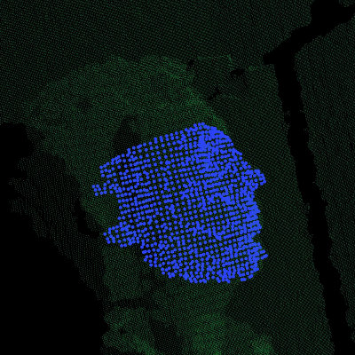
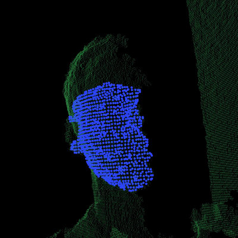
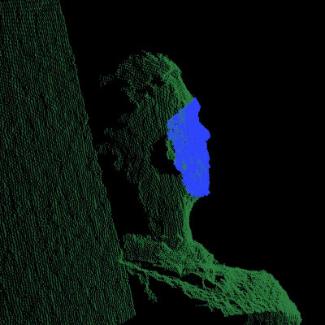
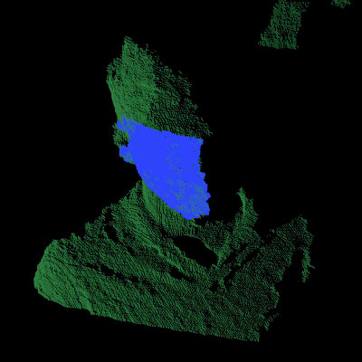

.. _template_alignment:

Aligning object templates to a point cloud
------------------------------------------

This tutorial gives an example of how some of the tools covered in the other tutorials can be combined to solve a higher level problem --- aligning a previously captured model of an object to some newly captured data.  In this specific example, we'll take a depth image that contains a person and try to fit some previously captured templates of their face; this will allow us to determine the position and orientation of the face in the scene.

.. raw:: html

  <iframe width="560" height="349" style="margin-left:50px" src="https://www.youtube.com/embed/1T5HxTTgE4I" frameborder="0" allowfullscreen></iframe>

We can use the code below to fit a template of a person's face (the blue points) to a new point cloud (the green points).

The code
--------

First, download the datasets from `github.com/PointCloudLibrary/data/tree/master/tutorials/template_alignment/ <https://github.com/PointCloudLibrary/data/tree/master/tutorials/template_alignment>`_
and extract the files.

Next, copy and paste the following code into your editor and save it as ``template_alignment.cpp`` (or download the source file :download:`here <./sources/template_alignment/template_alignment.cpp>`).

.. literalinclude:: sources/template_alignment/template_alignment.cpp
   :language: cpp
   :linenos:

The explanation
---------------

Now, let's break down the code piece by piece.

We'll start by examining the *FeatureCloud* class.  This class is defined in order to provide a convenient method for computing and storing point clouds with local feature descriptors for each point.

The constructor creates a new :pcl:`KdTreeFLANN <pcl::KdTreeFLANN>` object and initializes the radius parameters that will be used when computing surface normals and local features.

.. literalinclude:: sources/template_alignment/template_alignment.cpp
   :language: cpp
   :lines: 26-30

Then we define methods for setting the input cloud, either by passing a shared pointer to a PointCloud or by providing the name of a PCD file to load. In either case, after setting the input, *processInput* is called, which will compute the local feature descriptors as described later.

.. literalinclude:: sources/template_alignment/template_alignment.cpp
   :language: cpp
   :lines: 32-47

We also define some public accessor methods that can be used to get shared pointers to the points, surface normals, and local feature descriptors.

.. literalinclude:: sources/template_alignment/template_alignment.cpp
   :language: cpp
   :lines: 49-68

Next we define the method for processing the input point cloud, which first computes the cloud's surface normals and then computes its local features.

.. literalinclude:: sources/template_alignment/template_alignment.cpp
   :language: cpp
   :lines: 71-77

We use PCL's :pcl:`NormalEstimation <pcl::NormalEstimation>` class to compute the surface normals. To do so, we must specify the input point cloud, the KdTree to use when searching for neighboring points, and the radius that defines each point's neighborhood.  We then compute the surface normals and store them in a member variable for later use.

.. literalinclude:: sources/template_alignment/template_alignment.cpp
   :language: cpp
   :lines: 79-90

Similarly, we use PCL's :pcl:`FPFHEstimation <pcl::FPFHEstimation>` class to compute "Fast Point Feature Histogram" descriptors from the input point cloud and its surface normals.

.. literalinclude:: sources/template_alignment/template_alignment.cpp
   :language: cpp
   :lines: 92-104

The methods described above serve to encapsulate the work needed to compute feature descriptors and store them with their corresponding 3D point cloud.

Now we'll examine the *TemplateAlignment* class, which as the name suggests, will be used to perform template alignment (also referred to as template fitting/matching/registration).  A template is typically a small group of pixels or points that represents a known part of a larger object or scene.  By registering a template to a new image or point cloud, you can determine the position and orientation of the object that the template represents.

We start by defining a structure to store the alignment results.  It contains a floating point value that represents the "fitness" of the alignment (a lower number means a better alignment) and a transformation matrix that describes how template points should be rotated and translated in order to best align with the points in the target cloud.

.. note::

   Because we are including an Eigen::Matrix4f in this struct, we need to include the EIGEN_MAKE_ALIGNED_OPERATOR_NEW macro, which will overload the struct's "operator new" so that it will generate 16-bytes-aligned pointers.  If you're curious, you can find more information about this issue `here <http://eigen.tuxfamily.org/dox/group__TopicStructHavingEigenMembers.html>`_. For convenience, there is a redefinition of the macro in memory.h, aptly named PCL_MAKE_ALIGNED_OPERATOR_NEW which will let us for example call `pcl::make_shared` to create a `shared_ptr` of over-aligned classes.

.. literalinclude:: sources/template_alignment/template_alignment.cpp
   :language: cpp
   :lines: 122-128

In the constructor, we initialize the :pcl:`SampleConsensusInitialAlignment <pcl::SampleConsensusInitialAlignment>` (SAC-IA) object that we'll be using to perform the alignment, providing values for each of its parameters.  (Note: the maximum correspondence distance is actually specified as squared distance; for this example, we've decided to truncate the error with an upper limit of 1 cm, so we pass in 0.01 squared.)

.. literalinclude:: sources/template_alignment/template_alignment.cpp
   :language: cpp
   :lines: 130-139

Next we define a method for setting the target cloud (i.e., the cloud to which the templates will be aligned), which sets the inputs of SAC-IA alignment algorithm.

.. literalinclude:: sources/template_alignment/template_alignment.cpp
   :language: cpp
   :lines: 141-148

We then define a method for specifying which template or templates to attempt to align.  Each call to this method will add the given template cloud to an internal vector of FeatureClouds and store them for future use.

.. literalinclude:: sources/template_alignment/template_alignment.cpp
   :language: cpp
   :lines: 150-155

Next we define our alignment method.  This method takes a template as input and aligns it to the target cloud that was specified by calling :pcl:`setInputTarget <pcl::Registration::setInputTarget>`.  It works by setting the given template as the SAC-IA algorithm's source cloud and then calling its :pcl:`align <pcl::Registration::align>` method to align the source to the target.  Note that the :pcl:`align <pcl::Registration::align>` method requires us to pass in a point cloud that will store the newly aligned source cloud, but we can ignore this output for our application.  Instead, we call SAC-IA's accessor methods to get the alignment's fitness score and final transformation matrix (the rigid transformation from the source cloud to the target), and we output them as a Result struct.

.. literalinclude:: sources/template_alignment/template_alignment.cpp
   :language: cpp
   :lines: 157-169

Because this class is designed to work with multiple templates, we also define a method for aligning all of the templates to the target cloud and storing the results in a vector of Result structs.

.. literalinclude:: sources/template_alignment/template_alignment.cpp
   :language: cpp
   :lines: 171-180

Finally, we define a method that will align all of the templates to the target cloud and return the index of the best match and its corresponding Result struct.

.. literalinclude:: sources/template_alignment/template_alignment.cpp
   :language: cpp
   :lines: 182-206

Now that we have a class that handles aligning object templates, we'll apply it to the the problem of face alignment.  In the supplied data files, we've included six template point clouds that we created from different views of a person's face.  Each one was downsampled to a spacing of 5mm and manually cropped to include only points from the face.  In the following code, we show how to use our *TemplateAlignment* class to locate the position and orientation of the person's face in a new cloud.

First, we load the object template clouds.  We've stored our templates as .PCD files, and we've listed their names in a file called ``object_templates.txt``.  Here, we read in each file name, load it into a FeatureCloud, and store the FeatureCloud in a vector for later.

.. literalinclude:: sources/template_alignment/template_alignment.cpp
   :language: cpp
   :lines: 230-245

Next we load the target cloud (from the filename supplied on the command line).

.. literalinclude:: sources/template_alignment/template_alignment.cpp
   :language: cpp
   :lines: 247-249

We then perform a little pre-processing on the data to get it ready for alignment.  The first step is to filter out any background points.  In this example we assume the person we're trying to align to will be less than 1 meter away, so we apply a pass-through filter, filtering on the "z" field (i.e., depth) with limits of 0 to 1.

.. note:: This is application and data dependent. You may need to tune the
          threshold (or drop this filter entirely) to make it work with your
          data.

.. literalinclude:: sources/template_alignment/template_alignment.cpp
   :language: cpp
   :lines: 251-258

We also downsample the point cloud with a spacing of 5mm, which reduces the amount of computation that's required.

.. literalinclude:: sources/template_alignment/template_alignment.cpp
   :language: cpp
   :lines: 260-268

And after the pre-processing is finished, we create our target FeatureCloud.

.. literalinclude:: sources/template_alignment/template_alignment.cpp
   :language: cpp
   :lines: 270-272

Next, we initialize our *TemplateAlignment* object.  For this, we need to add each of our template clouds and set the target cloud.

.. literalinclude:: sources/template_alignment/template_alignment.cpp
   :language: cpp
   :lines: 274-280

Now that our *TemplateAlignment* object is initialized, we're ready call the *findBestAlignment* method to determine which template best fits the given target cloud.  We store the alignment results in *best_alignment*.

.. literalinclude:: sources/template_alignment/template_alignment.cpp
   :language: cpp
   :lines: 282-285

Next we output the results. Looking at the fitness score (*best_alignment.fitness_score*) gives us an idea of how successful the alignment was, and looking at the transformation matrix (*best_alignment.final_transformation*) tells us the position and orientation of the object we aligned to in the target cloud.  Specifically, because it's a rigid transformation, it can be decomposed into a 3-dimensional translation vector :math:`(t_x, t_y, t_z)` and a 3 x 3 rotation matrix :math:`R` as follows:

.. math::

  T = \left[ \begin{array}{cccc}
    &   &   & t_x \\
    & R &   & t_y \\
    &   &   & t_z \\
  0 & 0 & 0 &  1  \end{array} \right]

.. literalinclude:: sources/template_alignment/template_alignment.cpp
   :language: cpp
   :lines: 287-299

Finally, we take the best fitting template, apply the transform that aligns it to the target cloud, and save the aligned template out as a .PCD file so that we can visualize it later to see how well the alignment worked.

.. literalinclude:: sources/template_alignment/template_alignment.cpp
   :language: cpp
   :lines: 301-304

Compiling and running the program
---------------------------------

Add the following lines to your `CMakeLists.txt` file:

.. literalinclude:: sources/template_alignment/CMakeLists.txt
   :language: cmake
   :linenos:

After you have made the executable, you can run it like so::

  $ ./template_alignment data/object_templates.txt data/person.pcd

After a few seconds, you will see output similar to::

  Best fitness score: 0.000009

      |  0.834  0.295  0.466 |
  R = | -0.336  0.942  0.006 |
      | -0.437 -0.162  0.885 |

  t = < -0.373, -0.097, 0.087 >

You can also use the `pcl_viewer <http://www.pointclouds.org/documentation/overview/visualization.php>`_ utility to visualize the aligned template and overlay it against the target cloud by running the following command::

  $ pcl_viewer data/person.pcd output.pcd

The clouds should look something like this:

