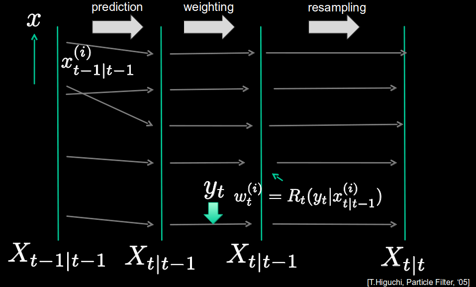
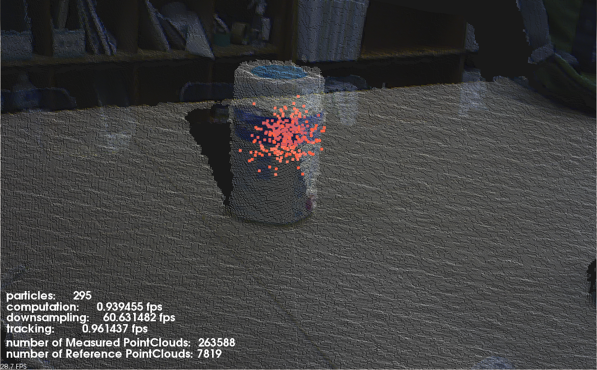
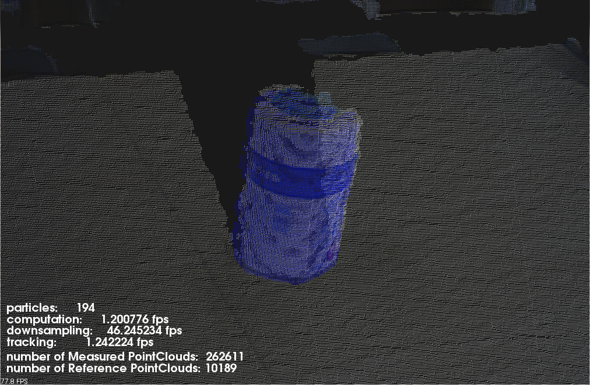

.. _tracking:

Tracking object in real time
----------------------------
This tutorial explains 6D object tracking and show example code(tracking_sample.cpp) using pcl::tracking libraries. Implementing this example code, you can see the segment track the target object even if you move tracked object or your sensor device. In example, first, you should initialize tracker and you have to pass target object's point cloud to tracker so that tracker should know what to track. So, before this tutorial, you need to make segmented model with PCD file beforehand. Setting the model to tracker, it starts tracking the object.

Following figure shows how  looks like when trakcing works successfully.

.. figure:: images/tracking/mergePicture.png
  :height: 600
  :align: center
 
  fig1: The blue model tracks the cup successfully with red particles.

Details
-------
The pcl_tracking library contains data structures and mechanism for 3D tracking which uses Particle Filter Algorithm. This tracking will enable you to implement 6D-pose (position and rotation) tracking which is optimized to run in real time.  

At each loop, tracking program proceeds along with following algorythm.(see fig2)
	1. (At  t = t - 1) At first, using previous Pariticle's information about position and rotation, it will predict each position and rotation of them at the next frame.

	2. Next, we calculate weights of those particles with the likelihood formula below.(you can select which likelihood function you use)

	3. Finally, we use the evaluate function which compares real point cloud data from depth sensor  with the predicted particles, and resample particles.

.. math::

	L_j = L_{distance} ( \times L_{color} )

	w = \sum{}^{} L_j

  fig2: The process of tracking Particle Filter

The code
--------

Create three files,  paste following code with your editor and save it as tracking_sample.cpp.

tracking_sample.cpp

.. literalinclude:: sources/tracking/tracking_sample.cpp
   :language: cpp
   :linenos:

The explanation
---------------

Now, let's break down the code piece by piece.

.. literalinclude:: sources/tracking/tracking_sample.cpp
   :language: cpp
   :lines: 224-239

First, in main function, these lines set the parameters for tracking. 

.. literalinclude:: sources/tracking/tracking_sample.cpp
   :language: cpp
   :lines: 243-254

Here, we set likelihood function which tracker use when calculate weights.  You can add more likelihood function as you like. By default, there are normals likelihood and color likelihood functions. When you want to add other likelihood function, all you have to do is  initialize new Coherence Class and add the Coherence instance to coherence variable with addPointCoherence function.

.. literalinclude:: sources/tracking/tracking_sample.cpp
   :language: cpp
   :lines: 256-269

In this part, we set the point cloud loaded from pcd file as reference model to tracker and also set model's transform values.

.. literalinclude:: sources/tracking/tracking_sample.cpp
   :language: cpp
   :lines: 170-177

Until the counter variable become equal to 10, we ignore the input point cloud, because the point cloud at first few frames often have noise. After counter variable reach to 10 frame, at each loop, we set downsampled input point cloud to tracker and the tracker will compute particles movement.

.. literalinclude:: sources/tracking/tracking_sample.cpp
   :language: cpp
   :lines: 79-79

In drawParticles function, you can get particles's positions by calling getParticles().

.. literalinclude:: sources/tracking/tracking_sample.cpp
   :language: cpp
   :lines: 113-114

In drawResult function, you can get model infomation about position and rotation.

Compiling and running the program
---------------------------------

Create a CMakeLists.txt file and add the following lines into it.

.. literalinclude:: sources/tracking/CMakeLists.txt
   :language: cmake
   :linenos:

If you finish saving CMakeLists.txt, let's prepare for running.

	1. Put the target object on a plane where there is nothing.
	2. Put sensor device about 1 meter away from target.
	3. Don't move the target and the device until you launch tracking program.
	4. Output only target point cloud with your other code (See :ref:`planar_segmentation` tutorial) and save as tracking_target.pcd

After you created model point cloud and the executable, you can then launch tracking_sample. Set device_id as second arguement and pcd file's name you made in above 4 as third.

	$ ./tracking_sample “#1” tracking_target.pcd

After few seconds, tracking will start working and you can move tracking object around. As you can see in following pictures, the blue point cloud is reference model segmentation's cloud and the red one is particles' cloud.

More Advanced
-------------
If you want to see more flexible and useful tracking code which starts tracking without preparing to make segemented model beforehand, you should refer a tracking code  https://github.com/PointCloudLibrary/pcl/blob/master/apps/src/openni_tracking.cpp. It will show you better and more legible code. The above Figures  are windows when you implement that code.

