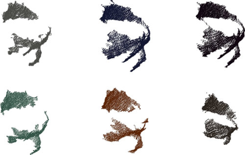
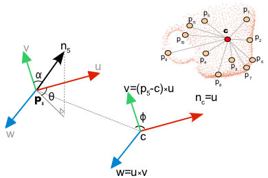
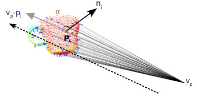
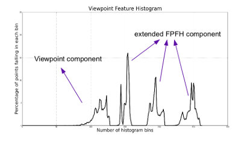
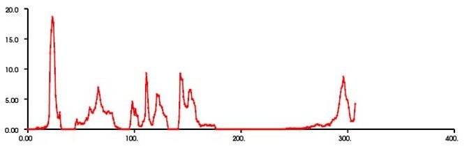

.. _vfh_estimation:

Estimating VFH signatures for a set of points
---------------------------------------------

This document describes the Viewpoint Feature Histogram ([VFH]_) descriptor, a
novel representation for point clusters for the problem of Cluster (e.g.,
Object) Recognition and 6DOF Pose Estimation.

The image below exhibits an example of VFH *recognition* and pose estimation.
Given a set of train data (top row, bottom row except the leftmost point
cloud), a model is learned and then a cloud (bottom left part) is used to
query/test the model. The matched results in order from best to worst go from
left to right starting at bottom left. For more information please see
:ref:`vfh_recognition` and/or [VFH]_.

Theoretical primer
------------------

The Viewpoint Feature Histogram (or VFH) has its roots in the FPFH descriptor
(see :ref:`fpfh_estimation`). Due to its speed and discriminative power, we
decided to leverage the strong recognition results of FPFH, but to add in
viewpoint variance while retaining invariance to scale.

Our contribution to the problem of object recognition and pose identification
was to extend the FPFH to be estimated for the entire object cluster (as seen
in the figure below), and to compute additional statistics between the
viewpoint direction and the normals estimated at each point. To do this, we
used the key idea of mixing the viewpoint direction directly into the relative
normal angle calculation in the FPFH.

The viewpoint component is computed by collecting a histogram of the angles
that the viewpoint direction makes with each normal. Note, we do not mean the
view angle to each normal as this would not be scale invariant, but instead we
mean the angle between the central viewpoint direction translated to each
normal. The second component measures the relative pan, tilt and yaw angles as
described in :ref:`fpfh_estimation` but now measured between the viewpoint
direction at the central point and each of the normals on the surface.

The new assembled feature is therefore called the Viewpoint Feature Histogram (VFH). The figure below presents this idea with the new feature consisting of two parts:

  1. a viewpoint direction component and

  2. a surface shape component comprised of an extended FPFH.

Estimating VFH features
-----------------------

The Viewpoint Feature Histogram is implemented in PCL as part of the
`pcl_features <http://docs.pointclouds.org/trunk/a02944.html>`_
library.

The default VFH implementation uses 45 binning subdivisions for each of the
three extended FPFH values, plus another 45 binning subdivisions for the distances between each point and the centroid and 128 binning subdivisions for the viewpoint
component, which results in a 308-byte array of float values. These are stored
in a **pcl::VFHSignature308** point type.

The major difference between the PFH/FPFH descriptors and VFH, is that for a
given point cloud dataset, only a single VFH descriptor will be estimated,
while the resultant PFH/FPFH data will have the same number of entries as the
number of points in the cloud.

The following code snippet will estimate a set of VFH features for all the
points in the input dataset.

.. code-block:: cpp
   :linenos:

   #include <pcl/point_types.h>
   #include <pcl/features/vfh.h>

   {
     pcl::PointCloud<pcl::PointXYZ>::Ptr cloud (new pcl::PointCloud<pcl::PointXYZ>);
     pcl::PointCloud<pcl::Normal>::Ptr normals (new pcl::PointCloud<pcl::Normal> ());

     ... read, pass in or create a point cloud with normals ...
     ... (note: you can create a single PointCloud<PointNormal> if you want) ...

     // Create the VFH estimation class, and pass the input dataset+normals to it
     pcl::VFHEstimation<pcl::PointXYZ, pcl::Normal, pcl::VFHSignature308> vfh;
     vfh.setInputCloud (cloud);
     vfh.setInputNormals (normals);
     // alternatively, if cloud is of type PointNormal, do vfh.setInputNormals (cloud);

     // Create an empty kdtree representation, and pass it to the FPFH estimation object.
     // Its content will be filled inside the object, based on the given input dataset (as no other search surface is given).
     pcl::search::KdTree<pcl::PointXYZ>::Ptr tree (new pcl::search::KdTree<pcl::PointXYZ> ());
     vfh.setSearchMethod (tree);

     // Output datasets
     pcl::PointCloud<pcl::VFHSignature308>::Ptr vfhs (new pcl::PointCloud<pcl::VFHSignature308> ());

     // Compute the features
     vfh.compute (*vfhs);

     // vfhs->size () should be of size 1*
   }

Visualizing VFH signatures
--------------------------

*libpcl_visualization* contains a special **PCLHistogramVisualization** class,
which is also used by **pcl_viewer** to automatically display the VFH
descriptors as a histogram of float values. For more information, please see
http://www.pointclouds.org/documentation/overview/visualization.php.

.. [VFH] http://www.willowgarage.com/sites/default/files/Rusu10IROS.pdf
.. note::
    @InProceedings{Rusu10IROS,
    author = {Radu Bogdan Rusu and Gary Bradski and Romain Thibaux and John Hsu},
    title = {Fast 3D Recognition and Pose Using the Viewpoint Feature Histogram},
    booktitle = {Proceedings of the 23rd IEEE/RSJ International Conference on Intelligent Robots and Systems (IROS)},
    year = {2010},
    address = {Taipei, Taiwan},
    month = {October}
    }

