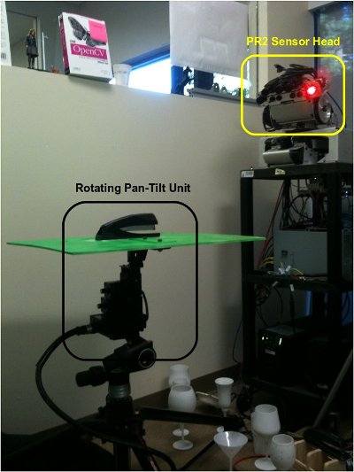
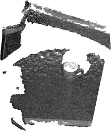
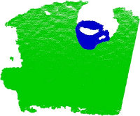
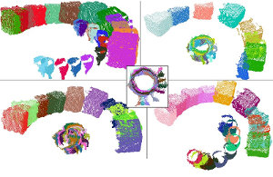
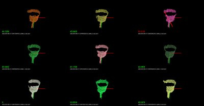
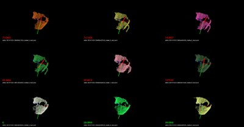
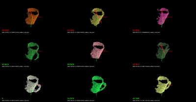

.. _vfh_recognition:

Cluster Recognition and 6DOF Pose Estimation using VFH descriptors
------------------------------------------------------------------

As previously described in :ref:`vfh_estimation`, Viewpoint Feature Histograms
(VFH) are powerful *meta-local* descriptors, created for the purpose of
recognition and pose estimation for **clusters** of points. We here refer to a
**cluster** as a collection of 3D points, most of the time representing a
particular object or part of a scene, obtained through some segmentation or
detection mechanisms (please see :ref:`cluster_extraction` for an example).

Our goal here is not to provide an ultimate recognition tool, but rather a
mechanism for obtaining **candidates** that *could potentially be the
cluster/object that is searched for*, together with its 6DOF pose in space.
With this in mind, we will be formulating the *recognition* problem as a
*nearest neighbor estimation* problem. So given a set of *training data*, we
will use efficient nearest neighbor search structures such as *kd-trees* and
return a set of potential candidates with sorted distances to the query object,
rather than an absolute *"this is the object that we were searching for"* kind
of response. The reader can imagine that such a system becomes much more useful
as we can explicitly reason about failures (false positives, or true
negatives).

For the purpose of this tutorial, the application example could be formulated as follows:

 * Training stage:

   * given a scene with 1 object that is easily separable as a cluster;

   * use a ground-truth system to obtain its pose (see the discussion below);

   * rotate around the object or rotate the object with respect to the camera, and compute a VFH descriptor for each view;

   * store the views, and build a kd-tree representation.

 * Testing stage:

   * given a scene with objects that can be separated as individual clusters, first extract the clusters;

   * for each cluster, compute a VFH descriptor from the current camera position;

   * use the VFH descriptor to search for candidates in the trained kd-tree.

We hope the above makes sense. Basically we're first going to create the set of
objects that we try to later on recognize, and then we will use that to obtain
valid candidates for objects in the scene.

A good example of a ground-truth system could be a simple rotating pan-tilt
unit such as the one in the figure below. Placing an object on the unit, and
moving it with some increments in both horizontal and vertical, can result in a
perfect ground-truth system for small objects. A cheaper solution could be to
use a marker-based system (e.g., checkerboard) and rotate the camera/table
manually.

Our Kd-Tree implementation of choice for the purpose of this tutorial is of
course, `FLANN <http://www.cs.ubc.ca/research/flann/>`_.

Training
--------

We begin the training by assuming that the *objects* are already separated as
individual clusters (see :ref:`cluster_extraction`), as shown in the figure
below:

Since we're only trying to cover the explicit training/testing of VFH
signatures in this tutorial, we provide a set of datasets already collected at:
`vfh_recognition_tutorial_data.tbz
<https://raw.github.com/PointCloudLibrary/data/master/tutorials/vfh_recognition/vfh_recognition_tutorial_data.tbz>`_.
The data is a subset of the objects presented in the figure below (left), and
look like the point clouds on the right. We used the pan-tilt table shown above
to acquire the data.

Next, copy and paste the following code into your editor and save it as
``build_tree.cpp``.

.. literalinclude:: sources/vfh_recognition/build_tree.cpp
   :language: cpp
   :linenos:

In the following paragraphs we will explain what the above code does (or should
do). We'll begin with the ``main`` function.

We begin by loading a set of feature models from a directory given as the first
command line argument (see details for running the example below). The
``loadFeatureModels`` method does nothing but recursively traverse a set of
directories and subdirectories, and loads in all *.PCD* files it finds. In
``loadFeatureModels``, we call ``loadHist``, which will attempt to open each
PCD file found, read its header, and check whether it contains a VFH signature
or not. Together with the VFH signature we also store the PCD file name into a
``vfh_model`` pair.  

Once all VFH features have been loaded, we convert them to FLANN format, using:

.. literalinclude:: sources/vfh_recognition/build_tree.cpp
   :language: cpp
   :lines: 113-118

Since we're lazy, and we want to use this data (and not reload it again by crawling the directory structure in the testing phase), we dump the data to disk:

.. literalinclude:: sources/vfh_recognition/build_tree.cpp
   :language: cpp
   :lines: 120-126

Finally, we create the KdTree, and save its structure to disk:

.. literalinclude:: sources/vfh_recognition/build_tree.cpp
   :language: cpp
   :lines: 129-133

Here we will use a ``LinearIndex``, which does a brute-force search using a
Chi-Square distance metric (see [VFH]_ for more information). For building a
proper kd-tree, comment line 1 and uncomment line 2 in the code snippet above.
The most important difference between a LinearIndex and a KDTreeIndex in FLANN
is that the KDTree will be much faster, while producing approximate nearest
neighbor results, rather than absolute.

So, we're done with training. To summarize:

  1. we crawled a directory structure, looked at all the .PCD files we found, tested them whether they are VFH signatures and loaded them in memory;

  2. we converted the data into FLANN format and dumped it to disk;

  3. we built a kd-tree structure and dumped it to disk.

Testing
-------

In the testing phase, we will illustrate how the system works by randomly
loading one of the files used in the training phase (feel free to supply your
own file here!), and checking the results of the tree.

Begin by copying and pasting the following code into your editor and save it as
``nearest_neighbors.cpp``.

.. literalinclude:: sources/vfh_recognition/nearest_neighbors.cpp
   :language: cpp
   :linenos:

The above code snippet is slightly larger, because we also included some
visualization routines and some other "eye candy" stuff.

In lines:

.. literalinclude:: sources/vfh_recognition/nearest_neighbors.cpp
   :language: cpp
   :lines: 132-143

we load the first given user histogram (and ignore the rest). Then we proceed
at checking two command line parameters, namely ``-k`` which will define how
many nearest neighbors to check and display on screen, and ``-thresh`` which
defines a maximum distance metric after which we will start displaying red
lines (i.e., crossing) over the **k** models found on screen (eye candy!).

In lines:

.. literalinclude:: sources/vfh_recognition/nearest_neighbors.cpp
   :language: cpp
   :lines: 162-163

   
we load the training data from disk, together with the list of file names that
we previously stored in ``build_tree.cpp``. Then, we read the kd-tree and rebuild the index:

.. literalinclude:: sources/vfh_recognition/nearest_neighbors.cpp
   :language: cpp
   :lines: 176-177

   
Here we need to make sure that we use the **exact** distance metric
(``ChiSquareDistance`` in this case), as the one that we used while creating
the tree. The most important part of the code comes here:

.. literalinclude:: sources/vfh_recognition/nearest_neighbors.cpp
   :language: cpp
   :lines: 178

Inside ``nearestKSearch``, we first convert the query point to FLANN format:

.. literalinclude:: sources/vfh_recognition/nearest_neighbors.cpp
   :language: cpp
   :lines: 75-76

Followed by obtaining the resultant nearest neighbor indices and distances for the query in:

.. literalinclude:: sources/vfh_recognition/nearest_neighbors.cpp
   :language: cpp
   :lines: 77-80

Lines:

.. literalinclude:: sources/vfh_recognition/nearest_neighbors.cpp
   :language: cpp
   :lines: 177-191

create a ``PCLVisualizer`` object, and sets up a set of different viewports (e.g., splits the screen into different chunks), which will be enabled in:

.. literalinclude:: sources/vfh_recognition/nearest_neighbors.cpp
   :language: cpp
   :lines: 211

Using the file names representing the models that we previously obtained in
``loadFileList``, we proceed at loading the model file names using:

.. literalinclude:: sources/vfh_recognition/nearest_neighbors.cpp
   :language: cpp
   :lines: 219-226

For visualization purposes, we demean the point cloud by computing its centroid and then subtracting it:

.. literalinclude:: sources/vfh_recognition/nearest_neighbors.cpp
   :language: cpp
   :lines: 238-243

   
Finally we check if the distance obtained by ``nearestKSearch`` is larger than the user given threshold, and if it is, we display a red line over the cloud that is being rendered in the viewport:

.. literalinclude:: sources/vfh_recognition/nearest_neighbors.cpp
   :language: cpp
   :lines: 252-258

Compiling and running the code
------------------------------

Create a new ``CMakeLists.txt`` file, and put the following content into it

.. literalinclude:: sources/vfh_recognition/CMakeLists.txt
   :language: cmake
   :linenos:

.. note::
	
	If you are running this tutorial on Windows, you have to install (`HDF5 1.8.7 Shared Library <http://www.hdfgroup.org/ftp/HDF5/current/bin/windows/>`_). If CMake is not able to find HDF5, 
	you can manually supply the include directory in HDF5_INCLUDE_DIR variable and the full path of **hdf5dll.lib** in HDF5_hdf5_LIBRARY variable. 
	Make sure that the needed dlls are in the same folder as the executables.

The above assumes that your two source files (``build_tree.cpp`` and ``nearest_neighbors.cpp``) are stored into the *src/* subdirectory.

Then, make sure that the datasets you downloaded (`vfh_recognition_tutorial_data.tbz
<https://raw.github.com/PointCloudLibrary/data/master/tutorials/vfh_recognition/vfh_recognition_tutorial_data.tbz>`_) are unpacked in this directory, thus creating a *data/* subdirectory.

After you have made the executable, you can run them like so::

  $ ./build/build_tree data/

You should see the following output on screen::

  > Loading data/001.324.25 (0 models loaded so far).
  > Loading data/800.919.49 (13 models loaded so far).
  > Loading data/100.922.16 (27 models loaded so far).
  > Loading data/901.125.07 (47 models loaded so far).
  > Loading data/000.580.67 (65 models loaded so far).
  > Loading data/463.156.00 (81 models loaded so far).
  > Loading data/401.431.44 (97 models loaded so far).
  > Loading data/100.919.00 (113 models loaded so far).
  > Loading data/401.324.52 (134 models loaded so far).
  > Loading data/201.327.78 (150 models loaded so far).
  > Loading data/300.151.23 (166 models loaded so far).
  > Loading data/200.921.07 (180 models loaded so far).
  > Loaded 195 VFH models. Creating training data training_data.h5/training_data.list.
  Building the kdtree index (kdtree.idx) for 195 elements...

The above crawled the *data/* subdirectory, and created a kd-tree with 195 entries. To run the nearest neighbor testing example, you have two options:

  1. Either run the following command manually, and select one of the datasets that we provided as a testing sample, like this::

        ./build/nearest_neighbors -k 16 -thresh 50 data/000.580.67/1258730231333_cluster_0_nxyz_vfh.pcd

  2. Or, if you are on a linux system, you can place the following on a bash script file (e.g., ``test.sh``)::

        #!/bin/bash

        # Example directory containing _vfh.pcd files
        DATA=data

        # Inlier distance threshold
        thresh=50

        # Get the closest K nearest neighbors
        k=16

        for i in `find $DATA -type d -name "*"`
        do
          echo $i
          for j in `find $i -type f \( -iname "*cluster*_vfh.pcd" \) | sort -R`
          do
            echo $j
            ./build/nearest_neighbors -k $k -thresh $thresh $j -cam "0.403137,0.868471/0,0,0/-0.0932051,-0.201608,-0.518939/-0.00471487,-0.931831,0.362863/1464,764/6,72"
          done
        done

    and run the script like this::

        bash test.sh

You should see *recognition* examples like the ones shown below:

