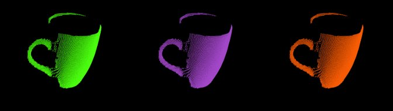
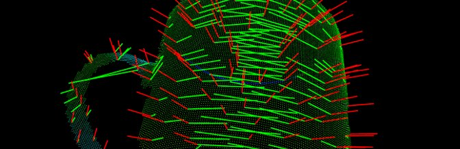
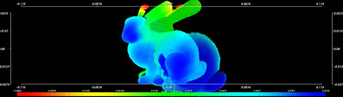

.. _visualization:

PCL Visualization overview
--------------------------

The **pcl_visualization** library was built for the purpose of being able to
quickly prototype and visualize the results of algorithms operating on 3D point
cloud data. Similar to OpenCV's **highgui** routines for displaying 2D images
and for drawing basic 2D shapes on screen, the library offers:

 * methods for rendering and setting visual properties (colors, point sizes,
   opacity, etc) for any n-D point cloud datasets in pcl::PointCloud<T> format;
   
  .. image:: images/visualization/bunny.jpg

 * methods for drawing basic 3D shapes on screen (e.g., cylinders, spheres,
   lines, polygons, etc) either from sets of points or from parametric
   equations; 

  .. image:: images/visualization/shapes.jpg

 * a histogram visualization module (PCLHistogramVisualizer) for 2D plots;

  .. image:: images/visualization/histogram.jpg

 * a multitude of Geometry and Color handler for pcl::PointCloud<T> datasets;

  .. image:: images/visualization/normals.jpg
  .. image:: images/visualization/pcs.jpg

 * a pcl::RangeImage visualization module.

  .. image:: images/visualization/range_image.jpg

The package makes use of the VTK library for 3D rendering for
range image and 2D operations.

For implementing your own visualizers, take a look at the tests and examples
accompanying the library.

.. note::

   Due to historical reasons, PCL 1.x stores RGB data as a packed float (to
   preserve backward compatibility). To learn more about this, please see the
   `PointXYZRGB
   <http://docs.pointclouds.org/trunk/structpcl_1_1_point_x_y_z_r_g_b.html>`_.

Simple Cloud Visualization
--------------------------

If you just want to visualize something in your app with a few lines of code,
use a snippet like the following one:

.. code-block:: cpp
   :linenos:

    #include <pcl_visualization/cloud_viewer.h>
    //...
    void 
    foo ()
    {
      pcl::PointCloud<pcl::PointXYZRGB> cloud;
      //... populate cloud
      pcl_visualization::CloudViewer viewer("Simple Cloud Viewer");
      viewer.showCloud(cloud);
      while (!viewer.wasStopped())
      {
      }
    }

PCD Viewer
----------

A quick way for visualizing PCD (Point Cloud Data) files is by using
**pcl_viewer**. As of 0.2.7, pcl_viewer's help screen looks like::

  Syntax is: pcl_viewer <file_name 1..N>.pcd <options>
    where options are:
                       -bc r,g,b                = background color
                       -fc r,g,b                = foreground color
                       -ps X                    = point size (1..64) 
                       -opaque X                = rendered point cloud opacity (0..1)
                       -ax n                    = enable on-screen display of XYZ axes and scale them to n
                       -ax_pos X,Y,Z            = if axes are enabled, set their X,Y,Z position in space (default 0,0,0)

                       -cam (*)                 = use given camera settings as initial view
   (*) [Clipping Range / Focal Point / Position / ViewUp / Distance / Window Size / Window Pos] or use a <filename.cam> that contains the same information.

                       -multiview 0/1           = enable/disable auto-multi viewport rendering (default disabled)

                       -normals 0/X             = disable/enable the display of every Xth point's surface normal as lines (default disabled)
                       -normals_scale X         = resize the normal unit vector size to X (default 0.02)

                       -pc 0/X                  = disable/enable the display of every Xth point's principal curvatures as lines (default disabled)
                       -pc_scale X              = resize the principal curvatures vectors size to X (default 0.02)

  (Note: for multiple .pcd files, provide multiple -{fc,ps} parameters; they will be automatically assigned to the right file)

Usage examples
--------------

.. code-block:: bash

  $ pcl_viewer -multiview 1 data/partial_cup_model.pcd data/partial_cup_model.pcd data/partial_cup_model.pcd

The above will load the ``partial_cup_model.pcd`` file 3 times, and will create a
multi-viewport rendering (``-multiview 1``).

Pressing ``h`` while the point clouds are being rendered will output the
following information on the console::

  | Help:
  -------
            p, P   : switch to a point-based representation
            w, W   : switch to a wireframe-based representation (where available)
            s, S   : switch to a surface-based representation (where available)

            j, J   : take a .PNG snapshot of the current window view
            c, C   : display current camera/window parameters

           + / -   : increment/decrement overall point size

            g, G   : display scale grid (on/off)
            u, U   : display lookup table (on/off)

      r, R [+ ALT] : reset camera [to viewpoint = {0, 0, 0} -> center_{x, y, z}]

      ALT + s, S   : turn stereo mode on/off
      ALT + f, F   : switch between maximized window mode and original size

            l, L           : list all available geometric and color handlers for the current actor map
      ALT + 0..9 [+ CTRL]  : switch between different geometric handlers (where available)
            0..9 [+ CTRL]  : switch between different color handlers (where available)

Pressing ``l`` will show the current list of available geometry/color handlers
for the datasets that we loaded. In this example::

  List of available geometry handlers for actor partial_cup_model.pcd-0: xyz(1) normal_xyz(2) 
  List of available color handlers for actor partial_cup_model.pcd-0: [random](1) x(2) y(3) z(4) normal_x(5) normal_y(6) normal_z(7) curvature(8) boundary(9) k(10) principal_curvature_x(11) principal_curvature_y(12) principal_curvature_z(13) pc1(14) pc2(15) 

Switching to a ``normal_xyz`` geometric handler using ``ALT+1`` and then
pressing ``8`` to switch to a curvature color handler, should result in the
following::

  $ pcl_viewer -normals 100 data/partial_cup_model.pcd

.. image:: images/visualization/ex2.jpg

The above will load the ``partial_cup_model.pcd`` file and render its every
``100`` th surface normal on screen.

.. code-block:: bash

  $ pcl_viewer -pc 100 data/partial_cup_model.pcd

.. image:: images/visualization/ex3.jpg

The above will load the ``partial_cup_model.pcd`` file and render its every
``100`` th principal curvature (+surface normal) on screen.

.. code-block:: bash

  $ pcl_viewer data/bun000.pcd data/bun045.pcd -ax 0.5 -ps 3 -ps 1

The above assumes that the ``bun000.pcd`` and ``bun045.pcd`` datasets have been
downloaded and are available. The results shown in the following picture were
obtained after pressing ``u`` and ``g`` to enable the lookup table and on-grid
display.  

Range Image Visualizer
----------------------

A quick way for visualizing range images is by using the binary of the tutorial
for range_image_visualization::

  $ tutorial_range_image_visualization data/office_scene.pcd

The above will load the ``office_scene.pcd`` point cloud file, create a range
image from it and visualize both, the point cloud and the range image.

