.. _walkthrough:

PCL Walkthrough
---------------

This tutorials will walk you through the components of your PCL installation, providing short descriptions of the modules, indicating where they are located and also listing the interaction between different components.

|

.. _Top:

Overview
--------

PCL is split in a number of modular libraries. The most important set of released PCL modules is shown below:

========================  ========================  ========================
Filters_                  Features_                 Keypoints_
|filters_small|           |features_small|          |keypoints_small|
Registration_                   KdTree_                   Octree_
|registration_small|      |kdtree_small|            |octree_small|
Segmentation_             `Sample Consensus`_       Surface_
|segmentation_small|      |sample_consensus_small|  |surface_small|
`Range Image`_            `I/O`_                        Visualization_
|range_image_small|       |io_small|                |visualization_small|
Common_					  Search_
|pcl_logo|                |pcl_logo|
========================  ========================  ========================

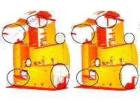

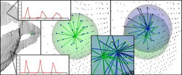

.. |keypoints_small| image:: images/keypoints_small.jpg

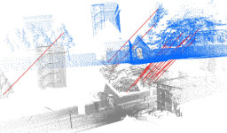

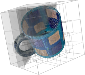

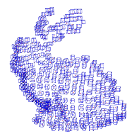

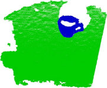

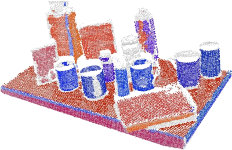

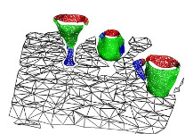

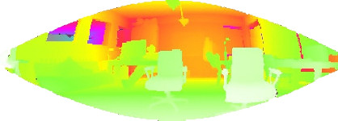

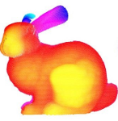

|

|

.. _Filters:

Filters
-------

**Background**

    An example of noise removal is presented in the figure below. Due to measurement errors, certain datasets present a large number of shadow points. This complicates the estimation of local point cloud 3D features. Some of these outliers can be filtered by performing a statistical analysis on each point's neighborhood, and trimming those that do not meet a certain criteria. The sparse outlier removal implementation in PCL is based on the computation of the distribution of point to neighbor distances in the input dataset. For each point, the mean distance from it to all its neighbors is computed. By assuming that the resulting distribution is Gaussian with a mean and a standard deviation, all points whose mean distances are outside an interval defined by the global distances mean and standard deviation can be considered as outliers and trimmed from the dataset.

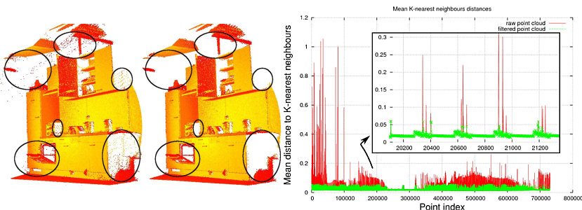

**Documentation:** http://docs.pointclouds.org/trunk/group__filters.html

**Tutorials:** http://pointclouds.org/documentation/tutorials/#filtering-tutorial

**Interacts with:**

	* `Sample Consensus`_
	* `Kdtree`_
	* `Octree`_

**Location:**

	* MAC OS X (Homebrew installation)
		- Header files: ``$(PCL_PREFIX)/pcl-1.6/pcl/filters/``
		- Binaries_: ``$(PCL_PREFIX)/bin/``
		- ``$(PCL_PREFIX)`` is the ``cmake`` installation prefix ``CMAKE_INSTALL_PREFIX``, e.g., ``/usr/local/``
	* Linux
		- Header files: ``$(PCL_PREFIX)/pcl-1.6/pcl/filters/``
		- Binaries_: ``$(PCL_PREFIX)/bin/``
		- ``$(PCL_PREFIX)`` is the ``cmake`` installation prefix ``CMAKE_INSTALL_PREFIX``, e.g., ``/usr/local/``
	* Windows
		- Header files: ``$(PCL_DIRECTORY)/include/pcl-1.6/pcl/filters/``
		- Binaries_: ``$(PCL_DIRECTORY)/bin/``
		- ``$(PCL_DIRECTORY)`` is the PCL installation directory, e.g.,  ``C:\Program Files\PCL 1.6\``

Top_

.. _Features:

Features
--------

**Background**

	A theoretical primer explaining how features work in PCL can be found in the `3D Features tutorial
	<http:/pointclouds.org/documentation/tutorials/how_features_work.php#how-3d-features-work>`_.
	
	The *features* library contains data structures and mechanisms for 3D feature estimation from point cloud data. 3D features are representations at certain 3D points, or positions, in space, which describe geometrical patterns based on the information available around the point. The data space selected around the query point is usually referred to as the *k-neighborhood*.

	The following figure shows a simple example of a selected query point, and its selected k-neighborhood.
	
	.. image:: images/features_normal.jpg

	An example of two of the most widely used geometric point features are the underlying surface's estimated curvature and normal at a query point ``p``. Both of them are considered local features, as they characterize a point using the information provided by its ``k`` closest point neighbors. For determining these neighbors efficiently, the input dataset is usually split into smaller chunks using spatial decomposition techniques such as octrees or kD-trees (see the figure below - left: kD-tree, right: octree), and then closest point searches are performed in that space. Depending on the application one can opt for either determining a fixed number of ``k`` points in the vicinity of ``p``, or all points which are found inside of a sphere of radius ``r`` centered at ``p``. Unarguably, one the easiest methods for estimating the surface normals and curvature changes at a point ``p`` is to perform an eigendecomposition (i.e., compute the eigenvectors and eigenvalues) of the k-neighborhood point surface patch. Thus, the eigenvector corresponding to the smallest eigenvalue will approximate the surface normal ``n`` at point ``p``, while the surface curvature change will be estimated from the eigenvalues as:

	.. image:: images/form_0.png
	
	.. image:: images/form_1.png
	
	|

	.. image:: images/features_bunny.jpg
	
	|
	
**Documentation:** http://docs.pointclouds.org/trunk/group__features.html

**Tutorials:** http://pointclouds.org/documentation/tutorials/#features-tutorial

**Interacts with:**

   * Common_
   * Search_
   * KdTree_
   * Octree_
   * `Range Image`_

**Location:**

	* MAC OS X (Homebrew installation)
		* Header files: ``$(PCL_PREFIX)/pcl-1.6/pcl/features/``
		* Binaries_: ``$(PCL_PREFIX)/bin/``
		* ``$(PCL_PREFIX)`` is the ``cmake`` installation prefix ``CMAKE_INSTALL_PREFIX``, e.g., ``/usr/local/``
	* Linux
		* Header files: ``$(PCL_PREFIX)/pcl-1.6/pcl/filters/``
		* Binaries_: ``$(PCL_PREFIX)/bin/``
		* ``$(PCL_PREFIX)`` is the ``cmake`` installation prefix ``CMAKE_INSTALL_PREFIX``, e.g., ``/usr/local/``
	* Windows
		- Header files: ``$(PCL_DIRECTORY)/include/pcl-1.6/pcl/features/``
		- Binaries_: ``$(PCL_DIRECTORY)/bin/``
		- ``$(PCL_DIRECTORY)`` is the PCL installation directory, e.g.,  ``C:\Program Files\PCL 1.6\``
		
Top_		

.. _Keypoints:	

Keypoints
---------		

**Background**

	The *keypoints* library contains implementations of two point cloud keypoint detection algorithms. Keypoints (also referred to as `interest points <http://en.wikipedia.org/wiki/Interest_point_detection>`_) are points in an image or point cloud that are stable, distinctive, and can be identified using a well-defined detection criterion. Typically, the number of interest points in a point cloud will be much smaller than the total number of points in the cloud, and when used in combination with local feature descriptors at each keypoint, the keypoints and descriptors can be used to form a compact—yet descriptive—representation of the original data.
	
	The figure below shows the output of NARF keypoints extraction from a range image:
	
	.. image:: images/narf_keypoint_extraction.png

|
	
**Documentation:** http://docs.pointclouds.org/trunk/group__keypoints.html

**Tutorials:** http://pointclouds.org/documentation/tutorials/#keypoints-tutorial

**Interacts with:**

   * Common_
   * Search_
   * KdTree_
   * Octree_
   * `Range Image`_
   * Features_
   * Filters_

**Location:**

	* MAC OS X (Homebrew installation)
		- Header files: ``$(PCL_PREFIX)/pcl-1.6/pcl/keypoints/``
		- Binaries_: ``$(PCL_PREFIX)/bin/``
		- ``$(PCL_PREFIX)`` is the ``cmake`` installation prefix ``CMAKE_INSTALL_PREFIX``, e.g., ``/usr/local/``
	* Linux
		- Header files: ``$(PCL_PREFIX)/pcl-1.6/pcl/filters/``
		- Binaries_: ``$(PCL_PREFIX)/bin/``
		- ``$(PCL_PREFIX)`` is the ``cmake`` installation prefix ``CMAKE_INSTALL_PREFIX``, e.g., ``/usr/local/``
	* Windows
		- Header files: ``$(PCL_DIRECTORY)/include/pcl-1.6/pcl/keypoints/``
		- Binaries_: ``$(PCL_DIRECTORY)/bin/``
		- ``$(PCL_DIRECTORY)`` is the PCL installation directory, e.g.,  ``C:\Program Files\PCL 1.6\``
		
Top_		

.. _Registration:

Registration
------------

**Background**

	Combining several datasets into a global consistent model is usually performed using a technique called registration. The key idea is to identify corresponding points between the data sets and find a transformation that minimizes the distance (alignment error) between corresponding points. This process is repeated, since correspondence search is affected by the relative position and orientation of the data sets. Once the alignment errors fall below a given threshold, the registration is said to be complete.

	The *registration* library implements a plethora of point cloud registration algorithms for both organized an unorganized (general purpose) datasets. For instance, PCL contains a set of powerful algorithms that allow the estimation of multiple sets of correspondences, as well as methods for rejecting bad correspondences, and estimating transformations in a robust manner.

	.. image:: images/registration/scans.jpg
	
	|
	
	.. image:: images/registration/s1-6.jpg

|

**Documentation:** http://docs.pointclouds.org/trunk/group__registration.html

**Tutorials:** http://pointclouds.org/documentation/tutorials/#registration-tutorial

**Interacts with:**

    * Common_
    * KdTree_
    * `Sample Consensus`_
    * Features_

**Location:**

	* MAC OS X (Homebrew installation)
		- Header files: ``$(PCL_PREFIX)/pcl-1.6/pcl/registration/``
		- Binaries_: ``$(PCL_PREFIX)/bin/``
		- ``$(PCL_PREFIX)`` is the ``cmake`` installation prefix ``CMAKE_INSTALL_PREFIX``, e.g., ``/usr/local/``
	* Linux
		- Header files: ``$(PCL_PREFIX)/pcl-1.6/pcl/filters/``
		- Binaries_: ``$(PCL_PREFIX)/bin/``
		- ``$(PCL_PREFIX)`` is the ``cmake`` installation prefix ``CMAKE_INSTALL_PREFIX``, e.g., ``/usr/local/``
	* Windows
		- Header files: ``$(PCL_DIRECTORY)/include/pcl-1.6/pcl/registration/``
		- Binaries_: ``$(PCL_DIRECTORY)/bin/``
		- ``$(PCL_DIRECTORY)`` is the PCL installation directory, e.g.,  ``C:\Program Files\PCL 1.6\``
		
Top_		

.. _KdTree:

Kd-tree
-------

**Background**

	A theoretical primer explaining how Kd-trees work can be found in the `Kd-tree tutorial <http://pointclouds.org/documentation/tutorials/kdtree_search.php#kdtree-search>`_.

	The *kdtree* library provides the kd-tree data-structure, using `FLANN <http://www.cs.ubc.ca/~mariusm/index.php/FLANN/FLANN>`_, that allows for fast `nearest neighbor searches <http://en.wikipedia.org/wiki/Nearest_neighbor_search>`_.

	A `Kd-tree <http://en.wikipedia.org/wiki/Kd-tree>`_ (k-dimensional tree) is a space-partitioning data structure that stores a set of k-dimensional points in a tree structure that enables efficient range searches and nearest neighbor searches. Nearest neighbor searches are a core operation when working with point cloud data and can be used to find correspondences between groups of points or feature descriptors or to define the local neighborhood around a point or points.

	.. image:: images/3dtree.png
	
	.. image:: images/kdtree_mug.jpg

|

**Documentation:** http://docs.pointclouds.org/trunk/group__kdtree.html

**Tutorials:** http://pointclouds.org/documentation/tutorials/#kdtree-tutorial

**Interacts with:** Common_

**Location:**

	* MAC OS X (Homebrew installation)
		- Header files: ``$(PCL_PREFIX)/pcl-1.6/pcl/kdtree/``
		- Binaries_: ``$(PCL_PREFIX)/bin/``
		- ``$(PCL_PREFIX)`` is the ``cmake`` installation prefix ``CMAKE_INSTALL_PREFIX``, e.g., ``/usr/local/``
	* Linux
		- Header files: ``$(PCL_PREFIX)/pcl-1.6/pcl/filters/``
		- Binaries_: ``$(PCL_PREFIX)/bin/``
		- ``$(PCL_PREFIX)`` is the ``cmake`` installation prefix ``CMAKE_INSTALL_PREFIX``, e.g., ``/usr/local/``
	* Windows
		- Header files: ``$(PCL_DIRECTORY)/include/pcl-1.6/pcl/kdtree/``
		- Binaries_: ``$(PCL_DIRECTORY)/bin/``
		- ``$(PCL_DIRECTORY)`` is the PCL installation directory, e.g.,  ``C:\Program Files\PCL 1.6\``
		
Top_		

.. _Octree:

Octree
------

**Background**

	The *octree* library provides efficient methods for creating a hierarchical tree data structure from point cloud data. This enables spatial partitioning, downsampling and search operations on the point data set. Each octree node the has either eight children or no children. The root node describes a cubic bounding box which encapsulates all points. At every tree level, this space becomes subdivided by a factor of 2 which results in an increased voxel resolution.

	The *octree* implementation provides efficient nearest neighbor search routines, such as "Neighbors within Voxel Search”, “K Nearest Neighbor Search” and “Neighbors within Radius Search”. It automatically adjusts its dimension to the point data set. A set of leaf node classes provide additional functionality, such as spacial "occupancy" and "point density per voxel" checks. Functions for serialization and deserialization enable to efficiently encode the octree structure into a binary format. Furthermore, a memory pool implementation reduces expensive memory allocation and deallocation operations in scenarios where octrees needs to be created at high rate.

	The following figure illustrates the voxel bounding boxes of an octree nodes at lowest tree level. The octree voxels are surrounding every 3D point from the Stanford bunny's surface. The red dots represent the point data. This image is created with the `octree_viewer`_.

	.. image:: images/octree_bunny.jpg

|

**Documentation:** http://docs.pointclouds.org/trunk/group__octree.html

**Tutorials:** http://pointclouds.org/documentation/tutorials/#octree-tutorial

**Interacts with:** Common_

**Location:**

	* MAC OS X (Homebrew installation)
		- Header files: ``$(PCL_PREFIX)/pcl-1.6/pcl/octree/``
		- Binaries_: ``$(PCL_PREFIX)/bin/``
		- ``$(PCL_PREFIX)`` is the ``cmake`` installation prefix ``CMAKE_INSTALL_PREFIX``, e.g., ``/usr/local/``
	* Linux
		- Header files: ``$(PCL_PREFIX)/pcl-1.6/pcl/filters/``
		- Binaries_: ``$(PCL_PREFIX)/bin/``
		- ``$(PCL_PREFIX)`` is the ``cmake`` installation prefix ``CMAKE_INSTALL_PREFIX``, e.g., ``/usr/local/``
	* Windows
		- Header files: ``$(PCL_DIRECTORY)/include/pcl-1.6/pcl/octree/``
		- Binaries_: ``$(PCL_DIRECTORY)/bin/``
		- ``$(PCL_DIRECTORY)`` is the PCL installation directory, e.g.,  ``C:\Program Files\PCL 1.6\``
		
Top_		

.. _Segmentation:

Segmentation
------------

**Background**

	The *segmentation* library contains algorithms for segmenting a point cloud into distinct clusters. These algorithms are best suited for processing a point cloud that is composed of a number of spatially isolated regions. In such cases, clustering is often used to break the cloud down into its constituent parts, which can then be processed independently.
	
	A theoretical primer explaining how clustering methods work can be found in the `cluster extraction tutorial <http://pointclouds.org/documentation/tutorials/cluster_extraction.php#cluster-extraction>`_.
	The two figures illustrate the results of plane model segmentation (left) and cylinder model segmentation (right). 
	
	.. image:: images/plane_model_seg.jpg
	
	.. image:: images/cylinder_model_seg.jpg
	
|

**Documentation:** http://docs.pointclouds.org/trunk/group__segmentation.html

**Tutorials:** http://pointclouds.org/documentation/tutorials/#segmentation-tutorial

**Interacts with:**

    * Common_
    * Search_
    * `Sample Consensus`_
    * KdTree_
    * Octree_

**Location:**

	* MAC OS X (Homebrew installation)
		- Header files: ``$(PCL_PREFIX)/pcl-1.6/pcl/segmentation/``
		- Binaries_: ``$(PCL_PREFIX)/bin/``
		- ``$(PCL_PREFIX)`` is the ``cmake`` installation prefix ``CMAKE_INSTALL_PREFIX``, e.g., ``/usr/local/``
	* Linux
		- Header files: ``$(PCL_PREFIX)/pcl-1.6/pcl/filters/``
		- Binaries_: ``$(PCL_PREFIX)/bin/``
		- ``$(PCL_PREFIX)`` is the ``cmake`` installation prefix ``CMAKE_INSTALL_PREFIX``, e.g., ``/usr/local/``
	* Windows
		- Header files: ``$(PCL_DIRECTORY)/include/pcl-1.6/pcl/segmentation/``
		- Binaries_: ``$(PCL_DIRECTORY)/bin/``
		- ``$(PCL_DIRECTORY)`` is the PCL installation directory, e.g.,  ``C:\Program Files\PCL 1.6\``
		
Top_		

.. _`Sample Consensus`:

Sample Consensus
----------------

**Background**

	The *sample_consensus* library holds SAmple Consensus (SAC) methods like RANSAC and models like planes and cylinders. These can combined freely in order to detect specific models and their parameters in point clouds.
	
	A theoretical primer explaining how sample consensus algorithms work can be found in the `Random Sample Consensus tutorial <http://pointclouds.org/documentation/tutorials/random_sample_consensus.php#random-sample-consensus>`_

	Some of the models implemented in this library include: lines, planes, cylinders, and spheres. Plane fitting is often applied to the task of detecting common indoor surfaces, such as walls, floors, and table tops. Other models can be used to detect and segment objects with common geometric structures (e.g., fitting a cylinder model to a mug).

	.. image:: images/sample_consensus_planes_cylinders.jpg

|

**Documentation:** http://docs.pointclouds.org/trunk/group__sample__consensus.html

**Tutorials:** http://pointclouds.org/documentation/tutorials/#sample-consensus

**Interacts with:** Common_

**Location:**

	* MAC OS X (Homebrew installation)
		- Header files: ``$(PCL_PREFIX)/pcl-1.6/pcl/sample_consensus/``
		- Binaries_: ``$(PCL_PREFIX)/bin/``
		- ``$(PCL_PREFIX)`` is the ``cmake`` installation prefix ``CMAKE_INSTALL_PREFIX``, e.g., ``/usr/local/``
	* Linux
		- Header files: ``$(PCL_PREFIX)/pcl-1.6/pcl/filters/``
		- Binaries_: ``$(PCL_PREFIX)/bin/``
		- ``$(PCL_PREFIX)`` is the ``cmake`` installation prefix ``CMAKE_INSTALL_PREFIX``, e.g., ``/usr/local/``
	* Windows
		- Header files: ``$(PCL_DIRECTORY)/include/pcl-1.6/pcl/sample_consensus/``
		- Binaries_: ``$(PCL_DIRECTORY)/bin/``
		- ``$(PCL_DIRECTORY)`` is the PCL installation directory, e.g.,  ``C:\Program Files\PCL 1.6\``
		
Top_		

.. _Surface:

Surface
-------

**Background**

	The *surface* library deals with reconstructing the original surfaces from 3D scans. Depending on the task at hand, this can be for example the hull, a mesh representation or a smoothed/resampled surface with normals.

	Smoothing and resampling can be important if the cloud is noisy, or if it is composed of multiple scans that are not aligned perfectly. The complexity of the surface estimation can be adjusted, and normals can be estimated in the same step if needed.

	.. image:: images/resampling_1.jpg

	Meshing is a general way to create a surface out of points, and currently there are two algorithms provided: a very fast triangulation of the original points, and a slower meshing that does smoothing and hole filling as well.

	.. image:: images/surface_meshing.jpg

	Creating a convex or concave hull is useful for example when there is a need for a simplified surface representation or when boundaries need to be extracted.

	.. image:: images/surface_hull.jpg

|

**Documentation:** http://docs.pointclouds.org/trunk/group__surface.html

**Tutorials:** http://pointclouds.org/documentation/tutorials/#surface-tutorial

**Interacts with:**

    * Common_
    * Search_
    * KdTree_
    * Octree_

**Location:**

	* MAC OS X (Homebrew installation)
		- Header files: ``$(PCL_PREFIX)/pcl-1.6/pcl/surface/``
		- Binaries_: ``$(PCL_PREFIX)/bin/``
		- ``$(PCL_PREFIX)`` is the ``cmake`` installation prefix ``CMAKE_INSTALL_PREFIX``, e.g., ``/usr/local/``
	* Linux
		- Header files: ``$(PCL_PREFIX)/pcl-1.6/pcl/filters/``
		- Binaries_: ``$(PCL_PREFIX)/bin/``
		- ``$(PCL_PREFIX)`` is the ``cmake`` installation prefix ``CMAKE_INSTALL_PREFIX``, e.g., ``/usr/local/``
	* Windows
		- Header files: ``$(PCL_DIRECTORY)/include/pcl-1.6/pcl/surface/``
		- Binaries_: ``$(PCL_DIRECTORY)/bin/``
		- ``$(PCL_DIRECTORY)`` is the PCL installation directory, e.g.,  ``C:\Program Files\PCL 1.6\``
		
Top_		

.. _`Range Image`:

Range Image
-----------

**Background**

	The *range_image* library contains two classes for representing and working with range images. A range image (or depth map) is an image whose pixel values represent a distance or depth from the sensor's origin. Range images are a common 3D representation and are often generated by stereo or time-of-flight cameras. With knowledge of the camera's intrinsic calibration parameters, a range image can be converted into a point cloud. 

	.. image:: images/range_image.jpg

|

**Documentation:** http://docs.pointclouds.org/trunk/group__range__image.html

**Tutorials:** http://pointclouds.org/documentation/tutorials/#range-images

**Interacts with:** Common_

**Location:**

	* MAC OS X (Homebrew installation)
		- Header files: ``$(PCL_PREFIX)/pcl-1.6/pcl/range_image/``
		- Binaries_: ``$(PCL_PREFIX)/bin/``
		- ``$(PCL_PREFIX)`` is the ``cmake`` installation prefix ``CMAKE_INSTALL_PREFIX``, e.g., ``/usr/local/``
	* Linux
		- Header files: ``$(PCL_PREFIX)/pcl-1.6/pcl/filters/``
		- Binaries_: ``$(PCL_PREFIX)/bin/``
		- ``$(PCL_PREFIX)`` is the ``cmake`` installation prefix ``CMAKE_INSTALL_PREFIX``, e.g., ``/usr/local/``
	* Windows
		- Header files: ``$(PCL_DIRECTORY)/include/pcl-1.6/pcl/range_image/``
		- Binaries_: ``$(PCL_DIRECTORY)/bin/``
		- ``$(PCL_DIRECTORY)`` is the PCL installation directory, e.g.,  ``C:\Program Files\PCL 1.6\``
		
Top_		

.. _`I/O`:

I/O
---

**Background**

	The *io* library contains classes and functions for reading and writing point cloud data (PCD) files, as well as capturing point clouds from a variety of sensing devices. An introduction to some of these capabilities can be found in the following tutorials:

    * `The PCD (Point Cloud Data) file format <http://pointclouds.org/documentation/tutorials/pcd_file_format.php#pcd-file-format>`_
    * `Reading PointCloud data from PCD files <http://pointclouds.org/documentation/tutorials/reading_pcd.php#reading-pcd>`_
    * `Writing PointCloud data to PCD files <http://pointclouds.org/documentation/tutorials/writing_pcd.php#writing-pcd>`_
    * `The OpenNI Grabber Framework in PCL <http://pointclouds.org/documentation/tutorials/openni_grabber.php#openni-grabber>`_

|

**Documentation:** http://docs.pointclouds.org/trunk/group__io.html

**Tutorials:** http://pointclouds.org/documentation/tutorials/#i-o

**Interacts with:**

    * Common_
    * Octree_
    * OpenNI for kinect handling

**Location:**

	* MAC OS X (Homebrew installation)
		- Header files: ``$(PCL_PREFIX)/pcl-1.6/pcl/io/``
		- Binaries_: ``$(PCL_PREFIX)/bin/``
		- ``$(PCL_PREFIX)`` is the ``cmake`` installation prefix ``CMAKE_INSTALL_PREFIX``, e.g., ``/usr/local/``
	* Linux
		- Header files: ``$(PCL_PREFIX)/pcl-1.6/pcl/filters/``
		- Binaries_: ``$(PCL_PREFIX)/bin/``
		- ``$(PCL_PREFIX)`` is the ``cmake`` installation prefix ``CMAKE_INSTALL_PREFIX``, e.g., ``/usr/local/``
	* Windows
		- Header files: ``$(PCL_DIRECTORY)/include/pcl-1.6/pcl/io/``
		- Binaries_: ``$(PCL_DIRECTORY)/bin/``
		- ``$(PCL_DIRECTORY)`` is the PCL installation directory, e.g.,  ``C:\Program Files\PCL 1.6\``
		
Top_		

.. _Visualization:

Visualization
-------------

**Background**

	The *visualization* library was built for the purpose of being able to quickly prototype and visualize the results of algorithms operating on 3D point cloud data. Similar to OpenCV's *highgui* routines for displaying 2D images and for drawing basic 2D shapes on screen, the library offers:

	methods for rendering and setting visual properties (colors, point sizes, opacity, etc) for any n-D point cloud datasets in ``pcl::PointCloud<T> format;``

	.. image:: images/bunny.jpg
	
    	methods for drawing basic 3D shapes on screen (e.g., cylinders, spheres,lines, polygons, etc) either from sets of points or from parametric equations;

	.. image:: images/shapes.jpg

	a histogram visualization module (PCLHistogramVisualizer) for 2D plots;

	.. image:: images/histogram.jpg

    	a multitude of Geometry and Color handlers for pcl::PointCloud<T> datasets;

	.. image:: images/normals.jpg

	|

	.. image:: images/pcs.jpg

	a ``pcl::RangeImage`` visualization module.

	.. image:: images/range_image.jpg

	The package makes use of the VTK library for 3D rendering for range image and 2D operations.

	For implementing your own visualizers, take a look at the tests and examples accompanying the library.

|

**Documentation:** http://docs.pointclouds.org/trunk/group__visualization.html

**Tutorials:** http://pointclouds.org/documentation/tutorials/#visualization-tutorial

**Interacts with:**

    * Common_
    * `I/O`_
    * KdTree_
    * `Range Image`_
    * VTK

**Location:**

	* MAC OS X (Homebrew installation)
		- Header files: ``$(PCL_PREFIX)/pcl-1.6/pcl/visualization/``
		- Binaries_: ``$(PCL_PREFIX)/bin/``
		- ``$(PCL_PREFIX)`` is the ``cmake`` installation prefix ``CMAKE_INSTALL_PREFIX``, e.g., ``/usr/local/``
	* Linux
		- Header files: ``$(PCL_PREFIX)/pcl-1.6/pcl/filters/``
		- Binaries_: ``$(PCL_PREFIX)/bin/``
		- ``$(PCL_PREFIX)`` is the ``cmake`` installation prefix ``CMAKE_INSTALL_PREFIX``, e.g., ``/usr/local/``
	* Windows
		- Header files: ``$(PCL_DIRECTORY)/include/pcl-1.6/pcl/visualization/``
		- Binaries_: ``$(PCL_DIRECTORY)/bin/``
		- ``$(PCL_DIRECTORY)`` is the PCL installation directory, e.g.,  ``C:\Program Files\PCL 1.6\``
		
Top_		

.. _Common:

Common
------

**Background**

	The *common* library contains the common data structures and methods used by the majority of PCL libraries. The core data structures include the PointCloud class and a multitude of point types that are used to represent points, surface normals, RGB color values, feature descriptors, etc. It also contains numerous functions for computing distances/norms, means and covariances, angular conversions, geometric transformations, and more.
	
**Location:**

	* MAC OS X (Homebrew installation)
		- Header files: ``$(PCL_PREFIX)/pcl-1.6/pcl/common/``
		- Binaries_: ``$(PCL_PREFIX)/bin/``
		- ``$(PCL_PREFIX)`` is the ``cmake`` installation prefix ``CMAKE_INSTALL_PREFIX``, e.g., ``/usr/local/``
	* Linux
		- Header files: ``$(PCL_PREFIX)/pcl-1.6/pcl/common/``
		- Binaries_: ``$(PCL_PREFIX)/bin/``
		- ``$(PCL_PREFIX)`` is the ``cmake`` installation prefix ``CMAKE_INSTALL_PREFIX``, e.g., ``/usr/local/``
	* Windows
		- Header files: ``$(PCL_DIRECTORY)/include/pcl-1.6/pcl/common/``
		- Binaries_: ``$(PCL_DIRECTORY)/bin/``
		- ``$(PCL_DIRECTORY)`` is the PCL installation directory, e.g.,  ``C:\Program Files\PCL 1.6\``	

Top_

.. _Search:

Search
------

**Background**

	The *search* library provides methods for searching for nearest neighbors using different data structures, including:

    * KdTree_
    * Octree_ 
    * brute force
    * specialized search for organized datasets
    
|

**Interacts with:**

	* `Common`_
	* `Kdtree`_
	* `Octree`_    
    
**Location:**
	* MAC OS X (Homebrew installation)
		- Header files: ``$(PCL_PREFIX)/pcl-1.6/pcl/search/``
		- Binaries_: ``$(PCL_PREFIX)/bin/``
		- ``$(PCL_PREFIX)`` is the ``cmake`` installation prefix ``CMAKE_INSTALL_PREFIX``, e.g., ``/usr/local/``
	* Linux
		- Header files: ``$(PCL_PREFIX)/pcl-1.6/pcl/search/``
		- Binaries_: ``$(PCL_PREFIX)/bin/``
		- ``$(PCL_PREFIX)`` is the ``cmake`` installation prefix ``CMAKE_INSTALL_PREFIX``, e.g., ``/usr/local/``
	* Windows
		- Header files: ``$(PCL_DIRECTORY)/include/pcl-1.6/pcl/search/``
		- Binaries_: ``$(PCL_DIRECTORY)/bin/``
		- ``$(PCL_DIRECTORY)`` is the PCL installation directory, e.g.,  ``C:\Program Files\PCL 1.6\``    
		
Top_		

.. _Binaries:

Binaries
--------

This section provides a quick reference for some of the common tools in PCL. 

	* ``pcl_viewer``: a quick way for visualizing PCD (Point Cloud Data) files. More information about PCD files can be found in the `PCD file format tutorial <http://pointclouds.org/documentation/tutorials/pcd_file_format.php>`_.

		**Syntax is: pcl_viewer <file_name 1..N>.<pcd or vtk> <options>**, where options are:
		
		                     -bc r,g,b                = background color
		
		                     -fc r,g,b                = foreground color
		
		                     -ps X                    = point size (1..64) 
		
		                     -opaque X                = rendered point cloud opacity (0..1)
		
		                     -ax n                    = enable on-screen display of XYZ axes and scale them to n
		
		                     -ax_pos X,Y,Z            = if axes are enabled, set their X,Y,Z position in space (default 0,0,0)
		

		                     -cam (\*\)                 = use given camera settings as initial view
		
		 						(\*\) [Clipping Range / Focal Point / Position / ViewUp / Distance / Field of View Y / Window Size / Window Pos] or use a <filename.cam> that contains the same information.

		                     -multiview 0/1           = enable/disable auto-multi viewport rendering (default disabled)

		                     -normals 0/X             = disable/enable the display of every Xth point's surface normal as lines (default disabled)
		                     -normals_scale X         = resize the normal unit vector size to X (default 0.02)

		                     -pc 0/X                  = disable/enable the display of every Xth point's principal curvatures as lines (default disabled)
		                     -pc_scale X              = resize the principal curvatures vectors size to X (default 0.02)

		*(Note: for multiple .pcd files, provide multiple -{fc,ps,opaque} parameters; they will be automatically assigned to the right file)*
							
		**Usage example:**
							
		``pcl_viewer -multiview 1 data/partial_cup_model.pcd data/partial_cup_model.pcd data/partial_cup_model.pcd``

		The above will load the partial_cup_model.pcd file 3 times, and will create a multi-viewport rendering (-multiview 1).
		
		.. image:: images/ex1.jpg

|
		
	* ``pcd_convert_NaN_nan``: converts "NaN" values to "nan" values. *(Note: Starting with PCL version 1.0.1 the string representation for NaN is “nan”.)*
		
		**Usage example:**
		
		``pcd_convert_NaN_nan input.pcd output.pcd``
	
	* ``convert_pcd_ascii_binary``: converts PCD (Point Cloud Data) files from ASCII to binary and viceversa. 
	
	 	**Usage example:**
		
		``convert_pcd_ascii_binary <file_in.pcd> <file_out.pcd> 0/1/2 (ascii/binary/binary_compressed) [precision (ASCII)]``
		
	* ``concatenate_points_pcd``: concatenates the points of two or more PCD (Point Cloud Data) files into a single PCD file.
	 	
	 	**Usage example:**
	 	
	 	``concatenate_points_pcd <filename 1..N.pcd>``
	 	
	 	*(Note: the resulting PCD file will be ``output.pcd``)*
		
	
	* ``pcd2vtk``: converts PCD (Point Cloud Data) files to the `VTK format <http://www.vtk.org/VTK/img/file-formats.pdf>`_. 
	
		**Usage example:**
		
		``pcd2vtk input.pcd output.vtk`` 	

	* ``pcd2ply``: converts PCD (Point Cloud Data) files to the `PLY format <http://en.wikipedia.org/wiki/PLY_%28file_format%29>`_. 

		**Usage example:**

		``pcd2ply input.pcd output.ply``

	* ``mesh2pcd``: convert a CAD model to a PCD (Point Cloud Data) file, using ray tracing operations.
	
	 	**Syntax is: mesh2pcd input.{ply,obj} output.pcd <options>**, where options are:
	 	
		                     -level X      = tesselated sphere level (default: 2)
		
		                     -resolution X = the sphere resolution in angle increments (default: 100 deg)
		
		                     -leaf_size X  = the XYZ leaf size for the VoxelGrid -- for data reduction (default: 0.010000 m)
	

	.. _`octree_viewer`: 
	
	* ``octree_viewer``: allows the visualization of `octrees`__
	
		**Syntax is: octree_viewer <file_name.pcd> <octree resolution>**
		
		**Usage example:**
		
		``Example: ./octree_viewer ../../test/bunny.pcd 0.02``
		
		.. image:: images/octree_bunny2.png
		
		__ Octree_

Top_

